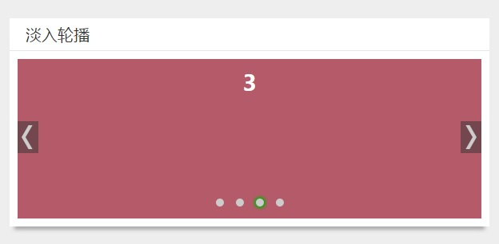

在前面又一篇博客写了[使用jQuery制作轮播图插件的原理和实例](//feleventh.github.io/%E4%BD%BF%E7%94%A8jQuery%E5%88%B6%E4%BD%9C%E8%BD%AE%E6%92%AD%E5%9B%BE/)，
但在后来的工作实践中发现在网页上使用较大尺寸的左右方向轮播时，在播放时间500ms内，图片左右切换需要在短时间内位移很大的距离，用户体验很差。
在浏览了大多电商网站后，发现大部分网站（例如京东、天猫等）的大尺寸首页焦点图都是以淡入效果来进行轮播的。经过实践发现，大尺寸内容更适合以淡入效果来轮播。

### 淡入轮播焦点图的原理
在浏览器控制台查看html代码，发现京东是以`z-index`属性和`opacity`属性的改变来进行淡入轮播的，而天猫则在这两个属性之外还用了display来控制淡入切换。
由于大型网站的js代码都比较复杂，我没有去花时间查找它们网页淡入轮播的相应js代码片段。
通过阅读html代码已经足够弄清楚其原理——即在所有轮播项使用`position:absolute;top:0;left:0;`后将其都叠加在轮播容器这同一个位置
，通过设置其中一个轮播项`z-index:1`,其他轮播项设置`z-index:0`来自显示一个轮播项，并通过jquery的`animate()`方法来控制`opacity`属性值从初始值0在一定时间间隔内渐变为1。

### 示例以及代码

如上图所示,除了轮播焦点图内容外，还有下面一排小圆点来手动跳转到某个内容项以及左右两边的上一个、下一个按钮。
并且当鼠标移动到轮播图容器上时，左右按钮才出现，且轮播暂停。暂停是通过clearInterval来实现，具体核心代码如下：

```html
<div class="card-content fade-slider">
    <ul>
        <li><a href="javascript:;"><h1>1</h1></a></li>
        <li><a href="javascript:;"><h1>2</h1></a></li>
        <li><a href="javascript:;"><h1>3</h1></a></li>
        <li><a href="javascript:;"><h1>4</h1></a></li>
    </ul>
    <div class="trigger"><p></p></div>
    <div class="turn">
        <a href="javascript:;" class="prev"></a>
        <a href="javascript:;" class="next"></a>
    </div>
</div>
<script>
  $().ready(function(){
    var index = 1;
    var len = $('li').length;
    for(var i=0; i<len; i++){
      $('.trigger p').append('<span>');
    }
    var w = $('.trigger p span:last').outerWidth(true);
    var m = $('.trigger p span:last').css('margin-left').replace('px','');
    $('.trigger p').css({width: len*w-m});
    $('.trigger p span:first').addClass('active');
    function play(){
      if(index === len){
        index = 0;
      }
      console.log(index);
      $('ul').children().eq(index).css({'z-index':1,opacity:.6}).animate({opacity: 1}, 500)
              .siblings('li').css({'z-index':0,opacity: 0});
      $('.trigger p span').eq(index).addClass('active').siblings().removeClass('active');
      index++;
    }
    var timer = setInterval(play,2500);
    /*hover暂停播放*/
    $('.fade-slider').hover(function () {
      clearInterval(timer);
    }, function () {
      timer = setInterval(play,2500);
    });
    /*点击上一个，下一个*/
    $('.turn .next').click(function(){
      play();
    })
    $('.turn .prev').click(function(){
      if(index ===0){
        index ===len;
      }
      index--;
      $('ul').children().eq(index-1).css({'z-index':1,opacity:.6}).animate({opacity: 1}, 500)
              .siblings('li').css({'z-index':0,opacity: 0});
      $('.trigger p span').eq(index-1).addClass('active').siblings().removeClass('active');
    });
    /*点击小圆点跳转*/
    $('.trigger span').click(function () {
      $(this).addClass('active').siblings().removeClass('active');
      index = $('.trigger span').index($(this));
      console.log('index');
      $('ul').children().eq(index).css({'z-index':1,opacity:.6}).animate({opacity: 1}, 500)
              .siblings('li').css({'z-index':0,opacity: 0});
      index++;
    })
  })
  /*核心scss代码如下
    .fade-slider{
  position: relative;
  height: 200px;
}
ul{
  list-style-type: none;
  position: relative;
  margin: 0;
  height: 200px;
  li{
    position: absolute;
    top: 0;
    left: 0;
    width: 100%;
    height: 200px;
    z-index: 0;
    opacity: 0;
    &:first-child{
      z-index: 1;
      opacity: 1;
    }
    a{
      text-decoration: none;
    }
    h1{
      display: block;
      width: 100%;
      height: 200px;
      text-align: center;
      color: #fff;
    }
  }
  @for $i from 1 through 4{
    li:nth-child(#{$i}){
      background: rgb($i*$i*20, $i*30, 255-50*$i);
    }
  }
}
.trigger{
  width: 100%;
  position: absolute;
  bottom: 20px;
  left: 0;
  z-index: 2;
  p{
    margin: 0 auto;
    span{
      margin-left: 15px;
      display: inline-block;
      width: 10px;
      height: 10px;
      border-radius: 5px;
      background: #ccc;
      cursor: pointer;
      &:first-child{
        margin-left: 0;
      }
      &.active{
        box-shadow: 0px 0px 5px 2px #00b300;
      }
    }
  }
}
.turn{
  position: absolute;
  top: 0;
  left: 0;
  display: none;
  width: 100%;
  height: 100%;
  z-index: 1;
  a{
    display: block;
    position: absolute;
    top: 40%;
    left: 0;
    width: 26px;
    height: 40px;
    background: rgba(51,51,51,.5);
    &:hover{
      &::before{
        background-color: #fff;
      }
    }
  }
  @mixin rectangle{
    content: '';
    display: block;
    position: absolute;
    width: 5px;
    height: 15px;
    background: #ccc;
  }
  .prev{
    margin-left: 10px;
    &::before{
      @include rectangle;
      top: 5px;
      left: 5px;
      transform-origin: 50% 100%;
      transform: skew(-30deg);
    }
    &::after{
      @include rectangle;
      bottom: 5px;
      left: 5px;
      transform-origin: 50% 0;
      transform: skew(30deg);
    }
  }
  .next{
    margin-right: 10px;
    left: auto;
    right: 0;
    &::before{
      @include rectangle;
      top: 5px;
      left: 15px;
      transform-origin: 50% 100%;
      transform: skew(30deg);
    }
    &::after{
      @include rectangle;
      bottom: 5px;
      left: 15px;
      transform-origin: 50% 0;
      transform: skew(-30deg);
    }
  }
}
.fade-slider:hover .turn{
  display: block;
}
  */
</script>
```

### 完整源代码请查看我的github的[blogDemo项目](//github.com/feleventh/blogDemo/blob/master/fade-slider.html)