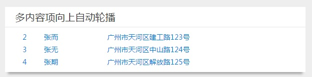
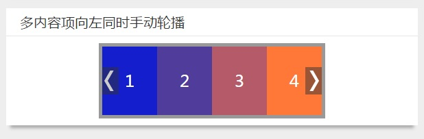

在前面我已经写了俩篇关于制作jquery轮播插件的博客了——[仿京东首页的淡入轮播焦点图](//feleventh.github.io/%E4%BB%BF%E4%BA%AC%E4%B8%9C%E9%A6%96%E9%A1%B5%E7%9A%84%E6%B7%A1%E5%85%A5%E8%BD%AE%E6%92%AD%E7%84%A6%E7%82%B9%E5%9B%BE/)和[使用jQuery制作轮播图插件的原理和实例](//feleventh.github.io/%E4%BD%BF%E7%94%A8jQuery%E5%88%B6%E4%BD%9C%E8%BD%AE%E6%92%AD%E5%9B%BE/)，
今天继续分享2个工作经常遇到的其他两种轮播情况。
在有的情况下，我们需要把所有轮播选项中的多项在轮播时呈现在用户面前。有的时候需要每次轮播一组数据，
有的时候需要多项一个一个地轮播。轮播的方向可以是左右方向的，也可能是上下方向的。

### 呈现多项的向上依次轮播

如上图所示，总共又4条数据，但只显示3条数据，每个一段时间向上自动轮播一条数据。
通过`animate()`方法改变`margin-top`的值来实现向上轮播，并使用clearInterval方法自动播放。核心代码如下：

```html
<div class="card">
    <div class="card-header">多内容项向上自动轮播</div>
    <div class="card-content up-slider">
      <ul>
        <li><a href="javascript:;"><span class="index">1</span><span class="name">张三</span><span class="address">广州市天河区体育东路122号</span></a></li>
        <li><a href="javascript:;"><span class="index">2</span><span class="name">张而</span><span class="address">广州市天河区建工路123号</span></a></li>
        <li><a href="javascript:;"><span class="index">3</span><span class="name">张无</span><span class="address">广州市天河区中山路124号</span></a></li>
        <li><a href="javascript:;"><span class="index">4</span><span class="name">张期</span><span class="address">广州市天河区解放路125号</span></a></li>
      </ul>
    </div>
</div>
<script>
$.fn.extend({
    scrollUp: function(o) {
      o = $.extend({
        delayTime: 2000,
        interTime: 1000,
        size: 5
      }, o);
      var el = $(this);
      if (el.children().length <= o.size) {
        return false;
      }
      var h = el.children().eq(0).height();

      function play() {
        var a = el.children().eq(0);
        a.animate({
          "margin-top": -h
        }, o.interTime, function() {
          a.css("margin-top", 0).appendTo(el);
        });
      }
      var timer = setInterval(play, o.delayTime);

      el.hover(function() {
        clearInterval(timer);
      }, function() {
        timer = setInterval(play, o.delayTime);
      });
    }
}
 $().ready(function(){
    $('.up-slider ul').scrollUp({size: 3});
  });
</script>
<!-- scss样式
.up-slider{
  ul{
    overflow: hidden;
    height: 70px;
    span{
      display: inline-block;
      overflow: hidden;
    }
    .index{
      width: 10%;
      text-align: center;
    }
    .name{
      width: 20%;
      padding-left: 10px;
    }
    .address{
      width: 65%;
      padding-left: 10px;
    }
  }
}
-->
```

### 呈现多项的向左分组轮播

如上图所示，总共又8条数据，但只显示4条数据，每个一段时间向左或向右自动轮播4个为一组的数据。
当鼠标停留在轮播容器上时，显示左右两个手动播放按钮。其核心代码如下：

```html
<div class="card">
    <div class="card-header">多内容项向左同时手动轮播</div>
    <div class="card-content left-slider">
      <div class="panel">
        <ul>
          <li><a href="javascript:;"><div class="content">1</div></a></li>
          <li><a href="javascript:;"><div class="content">2</div></a></li>
          <li><a href="javascript:;"><div class="content">3</div></a></li>
          <li><a href="javascript:;"><div class="content">4</div></a></li>
          <li><a href="javascript:;"><div class="content">5</div></a></li>
          <li><a href="javascript:;"><div class="content">6</div></a></li>
          <li><a href="javascript:;"><div class="content">7</div></a></li>
          <li><a href="javascript:;"><div class="content">8</div></a></li>
        </ul>
        <div class="turn">
          <a href="javascript:;" class="prev"></a>
          <a href="javascript:;" class="next"></a>
        </div>
      </div>
    </div>
</div>
<script>
  $.fn.extend({
      scrollLeft: function(o) {
      o = $.extend({
        interTime: 1500,
        size: 4
      }, o);
      var el = $(this);
      if (el.children().length <= o.size) {
        return false;
      }
      var w = el.children().eq(0).width();
      var len = el.children().length;
      var size = len>=8?4:(len-4)%4;
      el.css({
        width: w*len+w*15,
      })

      var prev = el.siblings('.turn').find('.prev');
      var next = el.siblings('.turn').find('.next');
      if(len<5){
        return el.siblings('.turn').remove();
      }
      el.siblings('.turn').append('<div class="mask hide"></div>');
      var mask = el.parent().siblings('.turn').find('.mask');
      next.click(function (event) {
        event.stopPropagation();
        mask.removeClass('hide');
        el.prepend('<div class="next-wrap clearfix"></div>');
        var nextWrap= el.find('.next-wrap');
        el.children().each(function(index){
          if(index<=size){
            $(this).appendTo(nextWrap);
          }
        });
        nextWrap.animate({"margin-left":-w*size},o.interTime,function(){
          nextWrap.children().each(function(){
            $(this).appendTo(el);
            mask.addClass('hide');
          });
          nextWrap.remove();
        });
      });
      prev.click(function(event){
        event.stopPropagation();
        mask.removeClass('hide');
        el.css({left: -w*size,width: w*el.children().length+w*size});
        el.children().each(function(index){
          if(index >= len-size){
            $(this).prependTo(el);
          }
        });
        el.animate({left:0},o.interTime,function(){
          mask.addClass('hide');
        });
      })
    }
  });
   $().ready(function(){
    $('.left-slider ul').scrollLeft({size:4});
  });
</script>
<!-- scss样式如下
.left-slider .panel{
  width: 320px;
  border: 5px solid #999;
  margin: 0 auto;
  position: relative;
  overflow: hidden;
  ul{
    overflow: hidden;
    height: 100px;
    position: relative;
    li{
      float: left;
      width: 80px;
      height: 100px;
      div{
        line-height: 100px;
        text-align: center;
        color: #fff;
        font-size: 24px;
      }
    }
    @for $i from 1 through 8{
      li:nth-child(#{$i}){
        background: rgb($i*$i*20, $i*30, 255-50*$i);
      }
    }
  }
}
.turn{
  position: absolute;
  top: 0;
  left: 0;
  display: none;
  width: 100%;
  height: 100%;
  z-index: 1;
  a{
    display: block;
    position: absolute;
    top: 30%;
    left: 0;
    width: 26px;
    height: 40px;
    background: rgba(51,51,51,.5);
    &:hover{
      &::before,&::after{
        background-color: #fff;
      }
    }
  }
  @mixin rectangle{
    content: '';
    display: block;
    position: absolute;
    width: 5px;
    height: 15px;
    background: #ccc;
  }
  .prev{
    margin-left: -2px;
    &::before{
      @include rectangle;
      top: 5px;
      left: 5px;
      transform-origin: 50% 100%;
      transform: skew(-30deg);
    }
    &::after{
      @include rectangle;
      bottom: 5px;
      left: 5px;
      transform-origin: 50% 0;
      transform: skew(30deg);
    }
  }
  .next{
    margin-right: -2px;
    left: auto;
    right: 0;
    &::before{
      @include rectangle;
      top: 5px;
      left: 15px;
      transform-origin: 50% 100%;
      transform: skew(30deg);
    }
    &::after{
      @include rectangle;
      bottom: 5px;
      left: 15px;
      transform-origin: 50% 0;
      transform: skew(-30deg);
    }
  }
}
.panel:hover .turn{
  display: block;
}
-->
```