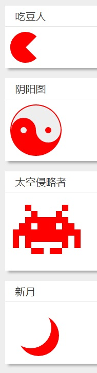

在前面我已经写了俩篇关于css制作图形的博客——[css3实现平行四边形框效果](//feleventh.github.io/css3%E5%AE%9E%E7%8E%B0%E5%B9%B3%E8%A1%8C%E5%9B%9B%E8%BE%B9%E5%BD%A2%E6%A1%86%E6%95%88%E6%9E%9C/)和[CSS制作任意角度三角形及其应用](//feleventh.github.io/CSS%E5%88%B6%E4%BD%9C%E4%BB%BB%E6%84%8F%E8%A7%92%E5%BA%A6%E4%B8%89%E8%A7%92%E5%BD%A2%E5%8F%8A%E5%85%B6%E5%BA%94%E7%94%A8/)。
三角形和平行四边形是网页中进场出现的图形，对于那些不是那么规则的图形往往采用图片的形式来呈现，但是使用css同样来制作出很多不太规则的一些图形，如五角星、太极图、吃豆人等等。

通过使用border的上下左右分别进行不同的设置，以及利用border-radius、box-shadow、transform变形可以将基本的div呈现出各种形状。下面是几个形状的示例：


scss样式如下：

```scss样式
.curved-bow{
  border: 0 solid transparent;
  border-top: 6px solid red;
  border-radius: 20px 20px 0px 0px;
  width: 40px;
  height: 24px;
}
.horn{
  border: 0 solid transparent;
  border-top: 6px solid red;
  border-radius: 20px 0px 0px 0px;
  width: 20px;
  height: 24px;
}
.curved-arrow {
  position: relative;
  width: 0;
  height: 0;
  border-top: 9px solid transparent;
  border-right: 9px solid red;
  transform: rotate(10deg);
}
.curved-arrow:after {
  content: "";
  position: absolute;
  border: 0 solid transparent;
  border-top: 3px solid red;
  border-radius: 20px 0 0 0;
  top: -12px;
  left: -9px;
  width: 12px;
  height: 12px;
  transform: rotate(45deg);
}
.star-five {
  margin: 25px 0;
  position: relative;
  display: block;
  color: red;
  width: 0px;
  height: 0px;
  border-right:  50px solid transparent;
  border-bottom: 35px  solid red;
  border-left:   50px solid transparent;
  transform:    rotate(35deg);
}

.star-five:before {
  border-bottom: 40px solid red;
  border-left: 15px solid transparent;
  border-right: 15px solid transparent;
  position: absolute;
  height: 0;
  width: 0;
  top: -23px;
  left: -33px;
  display: block;
  content: '';
  transform:    rotate(-35deg);
}
.star-five:after {
  position: absolute;
  display: block;
  color: red;
  top: 3px;
  left: -53px;
  width: 0px;
  height: 0px;
  border-right: 50px solid transparent;
  border-bottom: 35px solid red;
  border-left: 50px solid transparent;
  content: '';
  transform:    rotate(-70deg);
}
.heart {
  position: relative;
  width: 50px;
  height: 45px;
}
.heart:before,
.heart:after {
  position: absolute;
  content: "";
  left: 25px;
  top: 0;
  width: 25px;
  height: 40px;
  background: red;
  border-radius: 25px 25px 0 0;
  transform: rotate(-45deg);
  transform-origin: 0 100%;
}
.heart:after {
  left: 0;
  transform: rotate(45deg);
  transform-origin :100% 100%;
}

.infinity {
  position: relative;
  width: 106px;
  height: 50px;
}

.infinity:before,
.infinity:after {
  content: "";
  position: absolute;
  top: 0;
  left: 0;
  width: 30px;
  height: 30px;
  border: 10px solid red;
  border-radius: 25px 25px 0 25px;
  transform: rotate(-45deg);
}

.infinity:after {
  left: auto;
  right: 0;
  border-radius: 25px 25px 25px 0;
  transform: rotate(45deg);
}
.egg {
  display:block;
  width: 32px;
  height: 46px;
  background-color: red;
  border-radius:  50%  50%  50%  50%  / 60%   60%   40%  40%;
}
.pacman {
  width: 0px;
  height: 0px;
  border-right: 30px solid transparent;
  border-top: 30px solid red;
  border-left: 30px solid red;
  border-bottom: 30px solid red;
  border-top-left-radius: 30px;
  border-top-right-radius: 30px;
  border-bottom-left-radius: 30px;
  border-bottom-right-radius: 30px;
}

.yin-yang {
  width: 96px;
  height: 48px;
  background: #eee;
  border-color: red;
  border-style: solid;
  border-width: 2px 2px 50px 2px;
  border-radius: 100%;
  position: relative;
}
.yin-yang:before {
  content: "";
  position: absolute;
  top: 50%;
  left: 0;
  background: #eee;
  border: 18px solid red;
  border-radius: 100%;
  width: 12px;
  height: 12px;
}
.yin-yang:after {
  content: "";
  position: absolute;
  top: 50%;
  left: 50%;
  background: red;
  border: 18px solid #eee;
  border-radius:100%;
  width: 12px;
  height: 12px;
}

.space-invader{
  box-shadow:
          0 0 0 1em red,
          0 1em 0 1em red,
          -2.5em 1.5em 0 .5em red,
          2.5em 1.5em 0 .5em red,
          -3em -3em 0 0 red,
          3em -3em 0 0 red,
          -2em -2em 0 0 red,
          2em -2em 0 0 red,
          -3em -1em 0 0 red,
          -2em -1em 0 0 red,
          2em -1em 0 0 red,
          3em -1em 0 0 red,
          -4em 0 0 0 red,
          -3em 0 0 0 red,
          3em 0 0 0 red,
          4em 0 0 0 red,
          -5em 1em 0 0 red,
          -4em 1em 0 0 red,
          4em 1em 0 0 red,
          5em 1em 0 0 red,
          -5em 2em 0 0 red,
          5em 2em 0 0 red,
          -5em 3em 0 0 red,
          -3em 3em 0 0 red,
          3em 3em 0 0 red,
          5em 3em 0 0 red,
          -2em 4em 0 0 red,
          -1em 4em 0 0 red,
          1em 4em 0 0 red,
          2em 4em 0 0 red;
  background: red;
  width: 1em;
  height: 1em;
  overflow: hidden;

  margin: 50px 0 70px 65px;
}

.moon {
  width: 80px;
  height: 80px;
  margin-bottom: 20px;
  border-radius: 50%;
  box-shadow: 15px 15px 0 0 red;
}
```
