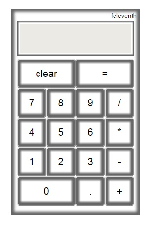

上个月angular2.0正式发布，可以预见由微软和谷歌合作推出的angular2.0将在未来一段时间内和reactjs、vuejs一道成为最流行的三大前端框架。
我决定先从当下最热门的reactjs开始入手，在今年内对这三大框架进行一个系统的学习。于是有了今天这个计算器的demo。

如下图所示，使用Key组件来将所有计算器的按键render到`.key-container`容器中去，并在组件中给所有按键赋予规定的文本值，并绑定点击事件。
其中`=`按键绑定的时间方法，直接使用`eval()`来进行对结果的计算。
key组件内部的`render方法`通过对存储按键文本值的数组进行`map`循环来渲染出计算器的所有按键。

```html
<!DOCTYPE html>
<html lang="zh-CN">
<head>
  <meta charset="UTF-8">
  <meta name="viewport" content="width=device-width,initial-scale=1,maximum-scale=1,user-scalable=no">
  <title>demo caculator</title>
  <link rel="stylesheet" href="assets/css/base.css">
  <script src="../build/react.js"></script>
  <script src="../build/react-dom.js"></script>
  <script src="../build/browser.min.js"></script>
  <script src="../build/jquery.min.js"></script>
</head>
<body>
  <div class="container">
    <div class="page">
      <div class="screen"><input type="text" disabled></div>
      <div class="key-container"></div>
    </div>
  </div>
  <script type="text/babel">
    var Key = React.createClass({
      render: function () {
        var keyNum = ['clear','=',7,8,9,'/',4,5,6,'*',1,2,3,'-',0,'.','+'];
        var keyNumDom = keyNum.map(function (ele, index) {
          var cName = '';
          if(typeof ele === 'number'||ele === '.'){
            cName = 'key-num';
            if(ele === 0){
              cName = 'key-num key-0'
            }
          }else{
            if(ele ==='clear'){
              cName = 'key-clear';
            }
            else if(ele === '='){
              cName = 'key-enter';
            }
            else{
              cName = 'key-operation';
            }
          }
          var handleClick = function(event){
            var input = $('.screen input');
            var key = event.target;
            if($(key).hasClass('key-num')){
              input.val(input.val()+key.innerHTML);
            }
            else if($(key).hasClass('key-operation')){
              if(input.val() === ''){
                input.val('0'+' '+key.innerHTML+' ');
              }else{
                input.val(input.val()+' '+key.innerHTML+' ');
              }
            }
            else if($(key).hasClass('key-clear')){
              input.val('');
            }
            else if($(key).hasClass('key-enter')){
              input.val(eval(input.val()));
            }
          };
          return (
                  <button key={index} className={cName} onClick={handleClick}>{ele}</button>
          );
        });
        return <div className="key-wrap">{keyNumDom}</div>;
      }
    });
    ReactDOM.render(<Key></Key>, document.querySelector('.key-container'));
  </script>
</body>
</html>
```

在样式风格设计上，直接使用box-shadow的边框阴影来模拟按键的轮廓。
如果最求更3D立体化的效果，还可以使用CSS3的`radial-gradient`渐变色和`perspective`来模拟光影效果，让立体感更加真实。
详细样式如下：

```css
/* scss样式代码 */
* {
  margin: 0;
  padding: 0;
}
html{
  font-size: 62.5%;
  font-family: "Microsoft YaHei UI";
  height: 100%;
}
body{
  font-size: 62.5%;
  height: 100%;
}
input,button,textarea{
  outline: none;
}

.container{
  position: absolute;
  top: 0;
  right: 0;
  bottom: 0;
  left: 0;
}

.page{
  box-shadow: inset 0 0 .5rem .5rem #666;
  position: relative;
  padding: 1rem;
  width: 20rem;
  height: 33rem;
  margin: 2rem auto;
  &::after{
    content: 'feleventh';
    display: block;
    position: absolute;
    top: .5rem;
    right: .5rem;
  }
}
.screen{
  width: 20rem;
  height: 6rem;
  box-shadow: inset 0 0 .2rem .2rem #666;
  margin: 1rem 0 0;
  input{
    width: 18rem;
    height: 4rem;
    border: none;
    padding: .5rem;
    margin: .5rem;
    text-align: right;
    font-size: 2rem;
  }
}
.key-container{
  width: 20rem;
  height: 25rem;
  position: relative;
}
button{
  width: 5rem;
  height: 5rem;
  box-shadow: inset 0 0 .4rem .5rem #666;
  border-radius: .4rem;
  background: #fff;
  font-size: 2rem;
  cursor: pointer;
}
.key-wrap{
  position: absolute;
  top: .5rem;
  left: 0;
  width: 20rem;
  height: 20rem;
  .key-clear,.key-enter,.key-0{
    width: 10rem;
  }
}

```

reactjs的理念是彻底抛弃DOM，完全组件化，使用虚拟DOM来渲染内容。按照这个理念，`div.container`、`div.screen`这些html元素都应该是使用组件来替代的。
这里为了代码简单就没有使用。DEMO详细代码见我的Github项目[reactjsLearning](//github.com/feleventh/reactjsLearning/tree/master/demo_caculator)。

