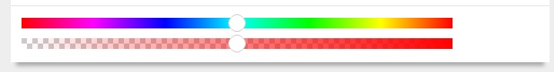
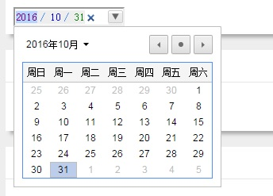
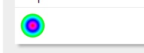
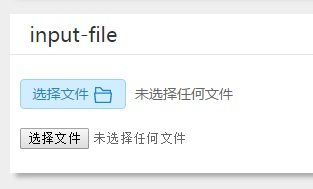
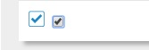
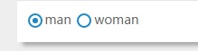

各个浏览器对html元素都有各种不同的默认样式，scss的compass的reset组件正是为了消除浏览器对html元素的默认样式。
对于表单元素而言，特别是input的各种类型元素，为了展示网页的独特风格，
同时也为了在不同浏览器中呈现一致的效果，往往需要自定义input元素的样式。
下面分享了使用CSS3自定义各种类型input的样式，包括range、date、color、checkbox、radio等等。

#### input-range

range是html5为input元素新增的类型，包含一定范围内数字值的输入域。
如上图示例通过-webkit-slider-thumb伪元素来自定义滑块的样式，并使用渐变色来定义滑块背景条的样式。
由于滑块背景条的背景颜色会覆盖住-webkit-slider-thumb伪类的背景，因此给-webkit-slider-thumb伪元素内部添加before伪元素来渲染白色背景色。
使用box-shadow来添加外轮廓的效果。
下面2个range类型的input，rgb类表示从左到右的rgb颜色值的变化，alpha类表示透明度值从左到右0到1的平滑变化。

```css
/*
<input type="range" class="rgb">
<input type="range" class="alpha">
*/
input[type="range"].rgb {
  margin-top: 2px;
  background: linear-gradient(to right,rgb(255,0,0), rgb(255,0,255), rgb(0,0,255),rgb(0,255,255), rgb(0,255,0), rgb(255,255,0), rgb(255,0,0) );
  width: 480px;
  -webkit-appearance: none;
  height: 12px;
  outline: none;
}
input[type="range"]::-webkit-slider-thumb {
  -webkit-appearance: none;
  cursor: default;
  height: 16px;
  width: 16px;
  background: none repeat scroll 0 0 #fff;
  border-radius: 8px;
  z-index: 5;
  box-shadow: 0 -1px 0 #fff, 0 1px 0 #fff,1px 0 0 #fff,-1px 0 0 #fff,
              0 -2px 0 #ccc, 0 2px 0 #ccc,2px 0 0 #ccc,-2px 0 0 #ccc,
              0 -1px 0 2px #fff inset, 0 1px 0 2px #fff inset,1px 0 0 #fff inset,-1px 0 0 2px #fff inset,;
  position: relative;
  &::before{
    display: block;
    content: '';
    position: absolute;
    top: 0;
    left: 0;
    width: 16px;
    height: 16px;
    background: #fff;
  }
}
input[type="range"].alpha {
  margin-top: 6px;
  background: url("../img/gray_white_12_12.png");
  width: 480px;
  -webkit-appearance: none;
  height: 12px;
  outline: none;
  position: relative;
  &::before{
    display: block;
    content: '';
    position: absolute;
    top: 0;
    left: 0;
    width: 480px;
    height: 12px;
    background: linear-gradient(to right,rgba(255,0,0,0), rgba(255,0,0,1) );
  }
}
```

#### input-date

html5还新增了专门用来表示日期和时间的类型，包括date, week，datetime等等。
同样，由于各个浏览器对h5的input新类型的支持程度不同，这里仅仅针对webkit内核的浏览器，使用-webkit-datetime-edit等一系列伪元素来自定义。

```css
input[type="date"]{
  outline: none;
  -webkit-appearance: none;
  &::-webkit-datetime-edit {  background: #1E88C7; }
  &::-webkit-datetime-edit-fields-wrapper { background-color: #eee; }
  &::-webkit-datetime-edit-text { color: #4D90FE; padding: 0 .3em; }
  &::-webkit-datetime-edit-year-field { color: purple; }
  &::-webkit-datetime-edit-month-field { color: blue; }
  &::-webkit-datetime-edit-day-field { color: green; }
  &::-webkit-inner-spin-button { visibility: hidden; }
  &::-webkit-calendar-picker-indicator {
    border: 1px solid #ccc;
    border-radius: 2px;
    box-shadow: inset 0 2px #fff, 0 2px #eee;
    background-color: #eee;
    background-image: -webkit-linear-gradient(top, #f0f0f0, #e6e6e6);
    color: #666;
  }
}
```

#### input-color


chrome浏览器上color类型的input默认样式是黑色的矩形块。
如上图，我将color类型的input样式设置成中心渐变的彩色圆形块，使之看上去更像一个取色器。
首先将input通过设置border-radius将其呈现为原型，然后使用-webkit-color-swatch-wrapper伪元素将其设置为中心渐变背景。

```css
input[type="color"] {
  width: 40px;
  height: 40px;
  border: 0;
  padding: 0;
  border-radius: 40px;
  outline: none;
  -webkit-appearance: none;
  &::-webkit-color-swatch-wrapper {
    border-radius: 40px;
    background: radial-gradient(red, magenta, blue, cyan, lime, yellow, red);
  }
  &::-webkit-color-swatch {
    display: none;
  }
}
```

#### input-file


如上图所示，分别是自定义的file类型的样式和Chrome默认的样式。
将input的opacity设置为0，然后使用绝对定位在相同的位置放置替代的file样式的a标签，再添加一个svg的文件icon。
最后在末尾加上选择文件的文件名。通过js获取到的input-file的value值是文件的目录名，还需要进行截取成文件名。

```css
/*
    <p>
        <a href="javascript:;" class="file">选择文件
          <input type="file">
          <svg width="20px" height="20px" viewBox="0 0 1024 1024">
            <path fill="#1E88C7" d="M82.2272 382.473309l14.6432 0L96.8704 136.229236c0-19.781818 16.477091-35.802764 35.923782-35.802764l1.145018 0 239.141236 0c10.966109 0 21.047855 5.157236 27.675927 12.939636L527.080727 247.919709l363.641018 0c19.6608 0 35.691055 16.235055 35.691055 36.0448l0 1.033309 0 97.4848 15.090036 0c19.688727 0 35.9424 16.030255 35.9424 35.597964 0 2.504145-0.465455 4.338036-0.912291 6.0416l-50.362182 467.428073c-1.591855 18.301673-17.389382 32.032582-35.458327 32.032582L132.794182 923.582836c-19.009164 0-35.011491-14.996945-35.923782-34.331927L46.740945 422.074182c-2.066618-19.241891 12.111127-37.301527 31.799855-39.042327l3.677091 0L82.217891 382.473309 82.2272 382.473309zM168.485236 382.473309 168.485236 382.473309l686.768873 0L855.254109 319.767273 511.525236 319.767273c-9.392873 0-18.767127-3.770182-25.637236-11.431564l-128.372364-136.266473L168.485236 172.069236 168.485236 382.473309 168.485236 382.473309zM901.697164 454.106764 901.697164 454.106764l-10.053818 0-0.912291 0-0.940218 0L132.794182 454.106764l-0.707491 0-9.811782 0 42.551855 398.066036 694.076509 0L901.697164 454.106764 901.697164 454.106764z"  />
          </svg>
        </a>
        <span>未选择任何文件</span>
      </p>
      <p><input type="file"></p>
*/
.file {
  position: relative;
  display: inline-block;
  background: #D0EEFF;
  border: 1px solid #99D3F5;
  border-radius: 4px;
  padding: 0 12px;
  overflow: hidden;
  color: #1E88C7;
  text-decoration: none;
  text-indent: 0;
  line-height: 28px;
  &:hover {
    background: #AADFFD;
    border-color: #78C3F3;
    color: #004974;
    text-decoration: none;
  }
  input {
    position: absolute;
    font-size: 100px;
    right: 0;
    top: 0;
    opacity: 0;
  }
  svg{
    vertical-align: middle;
  }
  &+span{
    vertical-align: top;
    line-height: 30px;
    margin-left: 5px;
  }
}
/*
$('.file input').change(function () {
    var fileName = $(this).val().split('\\');
    $(this).parents('.file').siblings('span').text(fileName[fileName.length-1]);
});
*/
```

#### input-checkbox


如上图所示，分别是自定义的checkbox类型的样式和Chrome默认的样式。
将input的opacity设置为0，然后使用绝对定位在相同的位置放置替代的file样式的a标签，再添加2个svg的文件icon。
分别为未选中状态的矩形框和选中时滑出来的对勾图形。使用js定义外层a标签的点击事件，当点击时，通过jquery的toggleClass方法在选中和未选中两种状态间切换。
选中则向下滑出对勾，未选中则对勾向上滑出。在css中通过设置transition属性来形成对勾上下滑动的效果。

```css
/*
<a href="javascript:;" class="checkbox">
    <input type="checkbox">
    <svg class="check" viewBox="0 0 1024 1024" width="20" height="20">
        <path fill="#1E88C7" d="M859.161 74l-694.32 0c-56.82 0-102.839 46.02-102.839 102.841l0 694.26c0 56.82 46.02 102.9 102.841 102.9l694.32 0c56.82 0 102.841-46.08 102.841-102.9l0-694.26c0-56.82-46.02-102.841-102.841-102.841zM917.001 877.58c0 28.32-23.161 51.42-51.36 51.42l-707.22 0c-28.32 0-51.42-23.161-51.42-51.42l0-707.159c0-28.26 23.161-51.42 51.42-51.42l707.159 0c28.26 0 51.36 23.161 51.36 51.42l0 707.159z" p-id="1489">
        </path>
    </svg>
    <svg class="checked" viewBox="0 0 1024 1024" width="20" height="20">
        <path fill="#1E88C7" d="M417.6 575.04l320.704-320.704 92.992 93.056-414.72 418.688-1.92-1.984-2.048 1.984-220.032-224 96-96L417.6 575.04z" p-id="1594"></path>
    </svg>
</a>
*/
.checkbox{
  position: relative;
  display: inline-block;
  width: 20px;
  height: 20px;
  overflow: hidden;
  input[type="checkbox"]{
    visibility: hidden;
    position: absolute;
    width: 20px;
    height: 20px;
    top: 0;
    left: 0;
    margin: 0;
  }
  .check{
    position: absolute;
    top: 0;
    left: 0;
  }
  .checked{
    position: absolute;
    top: -20px;
    left: 0;
    transition: top .3s;
  }
  &.active .checked {
    top: 0;
    transition: top .3s;
  }
}
/*
$('.checkbox').click(function () {
    $(this).toggleClass('active');
    $(this).find('input').prop('checked')?$(this).find('input').removeProp('checked'):$(this).find('input').prop('checked','checked');
});
*/
```

#### input-radio


如上图所示，分别是自定义的checkbox类型的样式和Chrome默认的样式。
将input的opacity设置为0，然后使用绝对定位在相同的位置放置替代的file样式的label标签的before伪元素和after伪元素。
其中before伪元素表示选中状态的外层圆环，after伪元素表示选中状态的内层圆。
label标签的radio-checked表示为选中状态。使用js定义外层label标签的点击事件，当点击时，选中状态在2个label中切换。
在css中通过设置after伪元素的transition属性来形成选中小圆点上下滑动的效果。

```css
/*
<label class="radio-checked"><input type="radio" name="gender" checked>man</label>
<label><input type="radio" name="gender">woman</label>
*/
label{
  display: inline-block;
  position: relative;
  cursor: pointer;
  overflow: hidden;
  input[type="radio"]{
    opacity: 0;
  }
  &::before{
    display: block;
    content: '';
    position: absolute;
    top: 4px;
    left: 2px;
    width: 12px;
    height: 12px;
    border-radius: 12px;
    border: 2px solid #1E88C7;
  }
  &::after{
    display: block;
    content: '';
    position: absolute;
    top: -7px;
    left: 7px;
    width: 6px;
    height: 6px;
    border-radius: 3px;
    background: #1E88C7;
    transition: top .3s;
  }
}
label.radio-checked{
  &::after{
    top: 9px;
    transition: top .3s;
  }
}
/*
$('label').click(function () {
    if($(this).not('radio-checked')){
    $(this).addClass('radio-checked').siblings().removeClass('radio-checked');
    $(this).find('input[type="radio"]').prop('checked','checked');
    $(this).siblings().find('input[type="radio"]').removeProp('checked');
    }
});
*/
```

### 完整源代码请查看我的github的[blogDemo项目](https://github.com/feleventh/blogDemo/blob/master/form_element.html)
