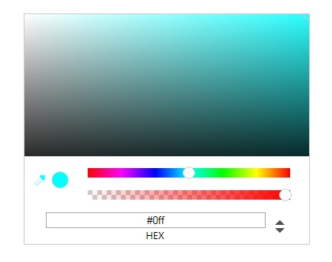

在前面的博客里面我使用react做了一个简易计算器的demo，这一次则做了一个稍微复杂的取色器demo。
如下图所示，该取色器参照了Chrome浏览器控制台的css样式功能区的取色器。

#### demo目标需求
取色器的目标需求基本与chrome控制台的取色器功能基本一致，具体如下：
* 用2个range类型的input来分别模拟色调滑块控制条和alpha透明度滑块控制条，滑动控制条，上方的矩形取色板的色调和右侧的圆形色块背景色以及下方的hex/rgba/hsla色值会相应地改变。
* 矩形取色板上有一个小圆点来进行取色，鼠标点击不同的位置可以选择相应位置的颜色，同时右侧的圆形色块背景色以及下方的hex/rgba/hsla色值会相应地改变。
* 右侧有一个吸管图标和圆形区域来实时地显示当前选中的颜色。
* 最下方是显示当前颜色的色值，色值的格式可以在hex/rgba/hsl三者之间切换。
同时，也可以在上面手动填写颜色的值，手动填写的值发生改变时，滑块、取色板以及取色板上圆点的位置都会发生对应的变化。

#### 创建react类及其render方法
首先创建一个组件类，render出取色器的dom结构，ColorWrap组建类最上面是类名为color-block的取色板。
取色板的左上角位置是取色板的对应色调的颜色值，向左颜色逐渐变为纯白色，向下逐渐变为纯黑色，且变化是均匀的。考虑到css 渐变背景只能是单向渐变的，svg的渐变u也是单向渐变的，
既不能做到水平、垂直方向同时满足渐变效果，于是我采用了canvas的像素点渲染来达成如上效果。
其中`renderBlockColor()`方法就是用来渲染canvas的，在`renderBlockColor()`方法中`imgData.data`数组就死canvas的颜色数组，
每4个一组分别代表一个像素点的r,g,b,a的值。
其他控件改变引起取色板色调改变时就调用`renderBlockColor()`方法重新渲染color-block类的canvas取色板。

```javascript
var ColorWrap = React.createClass({//取色器组件类
   render: function () {
      var value = this.state.value;
      var alpha = this.state.alpha;
      var x = this.state.x;
      var y = this.state.y;
      var hex = this.state.hex;
      var pickRgb = this.state.pickRgb;
      var hsl = this.state.hsl;
      return <div className="color-wrap">
        <canvas className="color-block"></canvas>
        <div className="color-picker-wrap" onClick = {this.handlePickerWrapClick}>
          <div className="color-picker" style={{left:x-6,top:y-6}}></div>
        </div>
        <div className="mask"></div>
        <div className="color-switch">
          <svg className="icon"  viewBox="0 0 1024 1024" width="20" height="20" fill={hex}>
            <path d="M825.196613 278.276576c15.172154-15.172154 15.172154-39.736595 0-54.908749L798.344309 196.515522c-15.172154-15.172154-39.736595-15.172154-54.908749 0l-65.866416 65.866416 81.761054 81.761054L825.196613 278.276576z">
            </path>
            <path d="M831.337723 416.752587l-226.378175-226.378175c-11.800564-11.800564-30.946378-11.800564-42.746943 0l-79.954845 79.954845c-11.800564 11.800564-11.800564 30.946378 0 42.746943l46.35936 46.35936L201.452493 686.479774c-20.109125 20.109125-20.109125 52.620884 0 72.730009l67.672625 67.672625c20.109125 20.109125 52.620884 20.109125 72.730009 0l327.164628-327.164628 39.495767 39.495767c11.800564 11.800564 30.946378 11.800564 42.746943 0l79.954845-79.954845C843.138288 447.578551 843.138288 428.553151 831.337723 416.752587zM333.185325 804.605833c-15.533396 15.533396-40.699906 15.533396-56.233302 0l-52.982126-52.982126c-15.533396-15.533396-15.533396-40.699906 0-56.233302L544.270931 374.968956l109.215428 109.215428L333.185325 804.605833z">
            </path>
            <path d="M201.813735 803.040452c0 13.125118 10.596425 23.721543 23.721543 23.721543l42.506115 0-66.227658-66.227658L201.813735 803.040452z">
            </path>
          </svg>
          <div className="circle" style={{background: hex,opacity:alpha/255}}></div>
        </div>
        <input className="rgb-range" type="range" min="0" step="1" max="1535" value={value} onChange={this.handleValueChange} />
        <input className="alpha-range" type="range" min="0" step="1" max="255" value={alpha} onChange={this.handleAlphaChange} />
        <ul className="color-show">
          <li className="hex">
            <input type="text" value={hex} onChange={this.handleHexChange} />
            <p>HEX</p>
          </li>
          <li className="rgba hide">
            <input type="text" value={pickRgb[0]} onChange={this.handleRgbChange} />
            <input type="text" value={pickRgb[1]} onChange={this.handleRgbChange} />
            <input type="text" value={pickRgb[2]} onChange={this.handleRgbChange} />
            <input type="text" value={alpha} onChange={this.handleAChange} />
            <p><span>R</span><span>G</span><span>B</span><span>A</span></p>
          </li>
          <li className="hsla hide">
            <input type="text" value={hsl[0]} onChange={this.handleHslChange} />
            <input type="text" value={hsl[1]} onChange={this.handleHslChange} />
            <input type="text" value={hsl[2]} onChange={this.handleHslChange} />
            <input type="text" value={alpha} onChange={this.handleAChange} />
            <p><span>H</span><span>S</span><span>L</span><span>A</span></p>
          </li>
        </ul>
        <svg className="switch" viewBox="0 0 1024 1024"  width="24" height="24" fill="#515151" onClick={this.handleSwitch}>
          <path d="M512 859.615l-260.711-260.711h521.422z"></path><path d="M512 164.385l-260.711 260.711h521.422z"></path>
        </svg>
      </div>;
    }
})

var renderBlockColor = function(rgba){//canvas渲染像素点
    var canvas = $('.color-block')[0];
    var context = canvas.getContext('2d');
    var width = 360;
    var height = 180;
    var imgData = context.createImageData(width,height);
    for (var i=0;i<imgData.data.length;i=i+4)
    {
      var x = (i%(360*4))/(360*4);//0-359
      var y = parseInt(i/(360*4))/179;//0-179
      imgData.data[i+0]=(255*(1-x)+rgba[0]*x)*(1-y);
      imgData.data[i+1]=(255*(1-x)+rgba[1]*x)*(1-y);
      imgData.data[i+2]=(255*(1-x)+rgba[2]*x)*(1-y);
      imgData.data[i+3]=rgba[3];
    }
    context.putImageData(imgData,0,0);
  };

```

#### 给组建类内部的元素绑定数据和事件
放了简便，我把所有数据都使用state来定义，也可以使用props来达到相同的效果。
首先把绑定的数据初始化，rgba为取色板左上角的颜色值，value为色调range的值，alpha为透明度range的值，
pickRgb为选取的颜色的rgb值的数组，x为取色板上取色小圆距离左上角的水平距离，y为取色板上取色小圆距离左上角的垂直距离，
hex为选取颜色的16位hex颜色表示的颜色值，hsl位hsl颜色表示的颜色值。其初始值在`getInitialState()`方法中定义。
然后分别给组建类内部的元素绑定事件。

首先给两个range滑块input元素绑定change事件。
其中色调的range类型的input的背景我们用css渐变色从red、magenta、blue、cyan、lime、yellow这六个主色调之间平滑渐变。
`background: linear-gradient(to right,rgb(255,0,0), rgb(255,0,255), rgb(0,0,255),rgb(0,255,255), rgb(0,255,0), rgb(255,255,0), rgb(255,0,0) );`
在色调的range类型的input的change事件绑定的方法`handleValueChange()`中，从获取到的value值来改变this.state.rgba的值。
同理，alpha滑块的事件监听也一样。

然后，给取色板的点击区域也就是color-picker-wrap类绑定点击事件来确定取色圆点的位置，
color-picker-wrap类元素是使用绝对定位覆盖在取色板canvas上的一个等尺寸的div，专门用来点击选取颜色的。
在handlePickerWrapClick()方法中根据点击的位置，重新设置取色小圆的css来改变其位置到点击的位置，
并实时修改hex\rgba\hsl等颜色值。

最后我们为颜色表示的input也绑定了change事件，当手动修改hex\rgba\hsl的值时，
根据颜色值来改变取色圆点的位置、滑块的位置以及取色板的色调。
在其change事件方法中，我们先确定rgb三个值哪个最大，哪个最小，来确定其色调。因为主色调的三个值中必有一个为最大值255，
一个为最小值0，根据最大值、最小值出现的位置，我们就确定了其色调，在根据其最大值与255之间的比率以及最小值吗我们就能确定其x值和y值。

```javascript
 getInitialState: function() {
  return {
    rgba:[0,255,255,255],
    value: 768,
    alpha: 255,
    pickRgb:[0,255,255],
    x: 359,
    y: 0,
    hex:'#0ff',
    hsl:[180,'100%','50%']
  };
},
handleValueChange: function(event){//滑动rgb颜色条
  this.setState({value: event.target.value});
  var rangeVal =this.state.value;
  var alpha = this.state.alpha;
  var color = '';
  var rgb = [];
  if(rangeVal<=255) {
    color = 'rgb(255,0,'+rangeVal+')';
    rgb = [255,0,rangeVal];
  }else if(rangeVal<256*2&&rangeVal>=256){
    color = 'rgb('+(2*255-rangeVal)+',0,255)';
    rgb = [2*255-rangeVal,0,255];
  }else if(rangeVal<256*3&&rangeVal>=256*2){
    color = 'rgb(0,'+(rangeVal-255*2)+',255)';
    rgb = [0,rangeVal-255*2,255];
  }else if(rangeVal<256*4&&rangeVal>=256*3){
    color = 'rgb(0,255,'+(255*4-rangeVal)+')';
    rgb = [0,255,255*4-rangeVal];
  }else if(rangeVal<256*5&&rangeVal>=256*4){
    color = 'rgb('+(rangeVal-255*4)+',255,0)';
    rgb = [rangeVal-255*4,255,0];
  }else if(rangeVal<256*6&&rangeVal>=256*5){
    color = 'rgb(255,'+(255*6-rangeVal)+',0)';
    rgb = [255,255*6-rangeVal,0];
  }
  var rgba = rgb.concat([alpha]);
  renderBlockColor(rgba);
  var x = this.state.x;
  var y = this.state.y;
  var pickRgb =[];
  pickRgb[0] = parseInt((255*(1-x/359)+rgba[0]*x/359)*(1-y/179));
  pickRgb[1] = parseInt((255*(1-x/359)+rgba[1]*x/359)*(1-y/179));
  pickRgb[2] = parseInt((255*(1-x/359)+rgba[2]*x/359)*(1-y/179));
  this.setState({rgba:rgba,pickRgb:pickRgb,hex:'#'+pickRgb.map(function(cv){
    if(cv>=16){
      return cv.toString(16);
    }else{
      return '0'+cv.toString(16);
    }
  }).join(''),hsl:rgbToHsl(pickRgb[0],pickRgb[1],pickRgb[2])});
},
handleAlphaChange: function(event){////滑动alpha条
  this.setState({alpha: event.target.value});
  var alpha =this.state.alpha;
  var rgba = this.state.rgba;
  rgba[3] = alpha;
  renderBlockColor(rgba);
  this.setState({rgba:rgba});
  if(alpha<255&&!$('.hex').hasClass('hide')){
    $('.hex').addClass('hide').next().removeClass('hide');
  }
},

handlePickerWrapClick: function (event) {//切换颜色单位制式
  var e = event || window.event;
  var scrollX = document.documentElement.scrollLeft || document.body.scrollLeft;
  var scrollY = document.documentElement.scrollTop || document.body.scrollTop;
  var x = e.pageX || e.clientX + scrollX;
  var y = e.pageY || e.clientY + scrollY;
  var canvasX = $('.color-picker-wrap').offset().left;
  var canvasY = $('.color-picker-wrap').offset().top;
  x = x-canvasX;
  y = y-canvasY;
  $('.color-picker').css({left:x-6,top:y-6});

  var rgba = this.state.rgba;
  var pickRgb = [];
  pickRgb[0] = parseInt((255*(1-x/359)+rgba[0]*x/359)*(1-y/179));
  pickRgb[1] = parseInt((255*(1-x/359)+rgba[1]*x/359)*(1-y/179));
  pickRgb[2] = parseInt((255*(1-x/359)+rgba[2]*x/359)*(1-y/179));
  var color = 'rgba('+pickRgb[0]+ ','+pickRgb[1]+ ','+pickRgb[2]+','+rgba[3]+')';
  $('.circle').css('background',color);
  this.setState({x:x,y:y,pickRgb:pickRgb,hex:'#'+pickRgb.map(function(cv){
    if(cv>=16){
      return cv.toString(16);
    }else{
      return '0'+cv.toString(16);
    }
  }).join(''),hsl:rgbToHsl(pickRgb[0],pickRgb[1],pickRgb[2])});
},
handleSwitch: function(){
  var index = $('.color-show li').index($('.color-show li:not(.hide)'));
  index===2?index=0:index++;
  if(this.state.alpha!==255){
    index===0?index=1:null;
  }
  console.log(index);
  $('.color-show li').eq(index).removeClass('hide').siblings('li').addClass('hide');
},
handleHexChange: function(event){
  var rgb = [];
  var inputVal = $.trim(event.target.value);
  this.setState({hex:inputVal});
  var pattern1 = /^#[0-9a-fA-F]{3}$/;
  var pattern2 = /^#[0-9a-fA-F]{6}$/;
  if(pattern1.test(inputVal)){
    rgb[0] = parseInt(inputVal.substr(1,1),16)*17;
    rgb[1] = parseInt(inputVal.substr(2,1),16)*17;
    rgb[2] = parseInt(inputVal.substr(3,1),16)*17;
  }else if(pattern2.test(inputVal)){
    rgb[0] = parseInt(inputVal.substr(1,2),16);
    rgb[1] = parseInt(inputVal.substr(3,2),16);
    rgb[2] = parseInt(inputVal.substr(5,2),16);
  }else{
    return false
  }
  var max = Math.max.apply(null, rgb);
  var min = Math.min.apply(null, rgb);
  var other = '';
  var maxIndex = rgb.indexOf(max);
  var minIndex = rgb.indexOf(min);
  if(max==min){
    maxIndex =0,minIndex =1;
    other = max;
  }else{
    other = rgb.filter(function(ele,index){
      return index!==maxIndex&&index!==minIndex;
    });
  }
  var rangeVal = '';
  switch([maxIndex,minIndex].toString()){
    case '0,1':
      rangeVal = rgb[2]*255/max;
      this.setState({rgba:[255,0,other,255]});
      break;
    case '2,1':
      rangeVal = 2*255-rgb[0]*255/max;
      this.setState({rgba:[other,0,max,255]});
      break;
    case '2,0':
      rangeVal = 2*255+rgb[1]*255/max;
      this.setState({rgba:[0,other,max,255]});
      break;
    case '1,0':
      rangeVal = 3*255-rgb[2]*255/max;
      this.setState({rgba:[0,255,other,255]});
      break;
    case '1,2':
      rangeVal = 3*255+rgb[0]*255/max;
      this.setState({rgba:[other,0,255,255]});
      break;
    case '0,2':
      rangeVal = 4*255-rgb[1]*255/max;
      this.setState({rgba:[max,other,0,255]});
      break;
  }
  renderBlockColor(this.state.rgba);
  $('.rgb-range').val(rangeVal);
  this.setState({value:rangeVal,y:parseInt(179-179*max/255),x:parseInt(359-359*min/max),pickRgb:rgb,
    hsl:rgbToHsl(rgb[0],rgb[1],rgb[2])});
},
handleRgbChange: function(event){
  var inputVal = $.trim(event.target.value);
  var index = $(event.target).parent().find('input').index($(event.target));
  var rgb = this.state.pickRgb;
  if(inputVal==''){return rgb[index]='',this.setState({pickRgb:rgb})}
  if(isNaN(inputVal)){return rgb[index]=0,this.setState({pickRgb:rgb})}

  var pattern = new RegExp('^[0-9]{0,3}');
  if(!pattern.test(inputVal)){
    return rgb[index]='',this.setState({pickRgb:rgb});
  }
  inputVal = parseInt(inputVal);
  if(inputVal>254){return false;}
  rgb[index] = inputVal;
  console.log(rgb);
  this.setState({pickRgb:rgb});
  var max = Math.max.apply(null, rgb);
  var min = Math.min.apply(null, rgb);
  var other = '';
  var maxIndex = rgb.indexOf(max);
  var minIndex = rgb.indexOf(min);
  if(max==min){
    maxIndex =0,minIndex =1;
    other = max;
  }else{
    other = rgb.filter(function(ele,index){
      return index!==maxIndex&&index!==minIndex;
    });
  }
  console.log([maxIndex,minIndex]);
  var rangeVal = '';
  switch([maxIndex,minIndex].toString()){
    case '0,1':
      rangeVal = rgb[2]*255/max;
      this.setState({rgba:[255,0,other,255]});
      break;
    case '2,1':
      rangeVal = 2*255-rgb[0]*255/max;
      this.setState({rgba:[other,0,max,255]});
      break;
    case '2,0':
      rangeVal = 2*255+rgb[1]*255/max;
      this.setState({rgba:[0,other,max,255]});
      break;
    case '1,0':
      rangeVal = 3*255-rgb[2]*255/max;
      this.setState({rgba:[0,255,other,255]});
      break;
    case '1,2':
      rangeVal = 3*255+rgb[0]*255/max;
      this.setState({rgba:[other,0,255,255]});
      break;
    case '0,2':
      rangeVal = 4*255-rgb[1]*255/max;
      this.setState({rgba:[max,other,0,255]});
      break;
  }
  renderBlockColor(this.state.rgba);
  $('.rgb-range').val(rangeVal);

  this.setState({value:rangeVal,y:parseInt(179-179*max/255),x:parseInt(359-359*min/max),pickRgb:rgb,
  hex:'#'+rgb.map(function(cv){
    if(cv>=16){
      return cv.toString(16);
    }else{
      return '0'+cv.toString(16);
    }
  }).join(''),hsl:rgbToHsl(rgb[0],rgb[1],rgb[2])});
},

handleAChange: function(event){
  var inputVal = $.trim(event.target.value);
  if(inputVal==''){return this.setState({a:''})}

  if(inputVal>=0||inputVal<=255){
    var rgba = this.state.rgba;
    var alpha = parseInt(inputVal);
    rgba[3] = alpha;
    this.setState({alpha:alpha,rgba:rgba});
    renderBlockColor(this.state.rgba);
  }
  this.setState({a:inputVal});
},
handleHslChange: function(event){
  var inputVal = $.trim(event.target.value);
  var hsl = this.state.hsl;
  var index = $(event.target).parent().find('input').index($(event.target));
  hsl[index] = inputVal;
  this.setState({hsl:hsl});
  var rgb = hslToRgb(parseInt(hsl[0])/360,parseInt(hsl[1].replace("%",""))/100,parseInt(hsl[2].replace("%",""))/100);
  var max = Math.max.apply(null, rgb);
  var min = Math.min.apply(null, rgb);
  var other = '';
  var maxIndex = rgb.indexOf(max);
  var minIndex = rgb.indexOf(min);
  if(max==min){
    maxIndex =0,minIndex =1;
    other = max;
  }else{
    other = rgb.filter(function(ele,index){
      return index!==maxIndex&&index!==minIndex;
    });
  }
  console.log([maxIndex,minIndex]);
  var rangeVal = '';
  switch([maxIndex,minIndex].toString()){
    case '0,1':
      rangeVal = rgb[2]*255/max;
      this.setState({rgba:[255,0,other,255]});
      break;
    case '2,1':
      rangeVal = 2*255-rgb[0]*255/max;
      this.setState({rgba:[other,0,max,255]});
      break;
    case '2,0':
      rangeVal = 2*255+rgb[1]*255/max;
      this.setState({rgba:[0,other,max,255]});
      break;
    case '1,0':
      rangeVal = 3*255-rgb[2]*255/max;
      this.setState({rgba:[0,255,other,255]});
      break;
    case '1,2':
      rangeVal = 3*255+rgb[0]*255/max;
      this.setState({rgba:[other,0,255,255]});
      break;
    case '0,2':
      rangeVal = 4*255-rgb[1]*255/max;
      this.setState({rgba:[max,other,0,255]});
      break;
  }
  renderBlockColor(this.state.rgba);
  $('.rgb-range').val(rangeVal);

  this.setState({value:rangeVal,y:parseInt(179-179*max/255),x:parseInt(359-359*min/max),pickRgb:rgb,hex:'#'+rgb.map(function(cv){
    if(cv>=16){
      return cv.toString(16);
    }else{
      return '0'+cv.toString(16);
    }
  }).join('')
  });
},

```

#### 不同颜色表示转换的方法
使用toString(16)能方便地将rgb颜色转换为hex颜色，使用parseInt(string,16)也能快速地将hex颜色转换为rgb颜色。
但hsl颜色表示的转换相对复杂，h表示了色调，从0到360度分别时从red、yellow、lime、cyan、blue、magenta、red依次过渡。
s和l分别表示饱和度和明度。下面2个方法分别是hsl到rgb的转换和rgb到hsl的转换。

```javascript
function hslToRgb(h, s, l){//0-1的小数
    var r, g, b;
    if(s == 0){
      r = g = b = l; // achromatic
    }else{
      var hue2rgb = function hue2rgb(p, q, t){
        if(t < 0) t += 1;
        if(t > 1) t -= 1;
        if(t < 1/6) return p + (q - p) * 6 * t;
        if(t < 1/2) return q;
        if(t < 2/3) return p + (q - p) * (2/3 - t) * 6;
        return p;
      }

      var q = l < 0.5 ? l * (1 + s) : l + s - l * s;
      var p = 2 * l - q;
      r = hue2rgb(p, q, h + 1/3);
      g = hue2rgb(p, q, h);
      b = hue2rgb(p, q, h - 1/3);
    }

    return [Math.round(r * 255), Math.round(g * 255), Math.round(b * 255)];
  }
  function rgbToHsl(r, g, b){
    r /= 255, g /= 255, b /= 255;
    var max = Math.max(r, g, b), min = Math.min(r, g, b);
    var h, s, l = (max + min) / 2;

    if(max == min){
      h = s = 0; // achromatic
    }else{
      var d = max - min;
      s = l > 0.5 ? d / (2 - max - min) : d / (max + min);
      switch(max){
        case r: h = (g - b) / d + (g < b ? 6 : 0); break;
        case g: h = (b - r) / d + 2; break;
        case b: h = (r - g) / d + 4; break;
      }
      h /= 6;
    }
    h = parseInt(h*360);
    s = parseInt(s*100)+"%";
    l = parseInt(l*100)+"%";

    return [h, s, l];
  }
```

### 完整源代码请查看我的github的[reactjsLearning项目](//github.com/feleventh/reactjsLearning/tree/master/color_picker/)