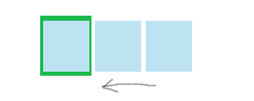

轮播图是网页以模拟循环播放幻灯片的形式展示图片以及其他包含丰富内容的一种常用工具，为站点添加了灵活的响应式表现形式。
在网络上，我们可以找到很多其他开发者开发好了轮播插件，bootstrap等UI框架也早就集成了轮播插件（如bootstrap的carousel.js）。为了弄清轮播图的原理，我借助jQuery尝试动手制作了自己的轮播图插件。

### 轮播图的基本原理
#### position的relative属性
我们先假设一个轮播的简单使用场景————三张图片的向左轮播。如下图所示，三个蓝色框代表图片依次向左循环移动，而只有绿色框对我们是可见的，这就形成了一个简单的轮播。



我们将最外层绿色展现框div.slide-wrap的position属性设置为relative或者absolute，包含三张图片的div.panel必须的宽度尽可能大，让三张图片附在容器上，当我们把div.slide-wrap的长宽设置为1张图片的长宽，并设置overflow为hidden，
这就让三张图片自有一张是可见的。而要是这三张图片向左滑动，则只需使用javascript让ul每隔一段时间向左移动一个图片的宽度，即left属性值减去一个图片的宽。

```html
// jade格式
div.slide-wrap
    div.panel
        a(href='/')
            img(src='images/company-slide1.jpg')
        a(href='/users')
            img(src='images/company-slide2.jpg')
        a(href='/heart')
            img(src='images/company-slide3.jpg')

// scss格式
.slide-wrap{
    width: 557px;
    height: 361px;
    position: relative;
    overflow: hidden;
    .panel{
      @extend .slide-wrap;
      width: 2900px;
      left: -557px;
      img{
        display: inline-block;
        float: left;
        position: relative;
      }
    }
```

#### 使用setTimeout实现图片的自动滑动
在做好布局后，就需要使用setTimeout来实现图片的自动滑动，但当我们使用setTimeout无线循环播放图片时，会发现向左滑动完三张图片后，就没图片了。
当滑倒第三个图片后，这时就需要设置重新将这三张图片移到起点。但即便这样，最后一张图片重新滑到第一张图片时候，还会产生一个空白滑过的情况。
可以通过将首尾2张图片分别使用`$().clone()`将其复制一份，将最后一张图片复制一份到第一张图片前面，将第一张图片复制一份到最后一张图片的后面，这样就解决了这个问题。
js代码如下：

```javascript
var index=0, t='';
var firstDom = $('.panel a:first').clone();
var lastDom = $('.panel a:last').clone();
firstDom.appendTo('.panel');// clone the first img to append it to the panel
lastDom.prependTo('.panel');// clone the first img to append it to the panel

var sliderAuto = function () {
    var num =$('.panel img').length;
    index = index+1;
    if(index < num){
        $('.panel').animate({left: -557*index}, 500, function(){} );
    }else{
        index = 2;
        $('.panel').css({left: -557});
        $('.panel').animate({left: -557*index}, 500, function(){} );
        
    }
    t = setTimeout("sliderAuto()", 2000);
}
$().ready(function () {
    sliderAuto();
});
```
#### 继续优化
做好上面工作后，还可以向轮播图添加手动点击滑动按钮等功能。另外，我们上面的图片是固定的三个，还可以是很多张图片，轮播的内容也不仅仅只是图片，还可以是其他的富媒体内容。
在最后，我们还可以尝试使用`jquery.fn.extend()`来封装成可复用的jquery插件。