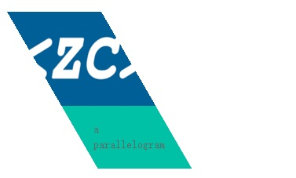

利用CSS3可以不依赖图片资源就能制作出各式各样的形状、图形和动画。
平行四边形也是一种常常出现在网页上的表现形式，使用CSS3可以制作出各种平行四边形，平行四边形的文本、图片甚至是动画。

### CSS3如何制作平行四边形？
使用CSS3 `transform`的`skew`属性可以将一个矩形变为非90度直角的平行四边形。
如下代码所示，是一个简单的平行四边形，使用skew属性为这个平行四边形向左倾斜30度。
注意，transform的变形是默认已元素的中心位置来进行，倾斜、旋转等变形的。
设置transform-origin能改变形的基准点，下例是将左上角设为基准点，否则会由于从中心点倾斜导致平行四边形向左偏移。

```css
.parallelogram-simple{
  width: 200px;
  height: 100px;
  transform-origin: 0 0;
  transform: skew(30deg);
  background: rgb(0,192,165);
}
```
### CSS3制作包含图片和文字的的平行四边形
如下图，是一个包含有文字和图片的平行四边形，上半部分是图片，下半部分是文字描述。


在发生transform的skew变形后，里面的图片和文字也会发生相同的倾斜角度，
在此基础上再将平行四边形里面的图片和文字向相反的方向倾斜相同的角度，就可使他们恢复在正常显示的效果。
通过设置平行四边形的overflow值为overflow，可以使图片只显示平行四边形里面的内容，从而达到显示出平行四边形图片的效果。
scss代码如下：

```html
.parallelogram-more{ 
  width: 120px;
  height: 200px;
  transform-origin: 0 0;
  transform: skew(30deg);
  background: #00c0a5;
  position: relative;
  overflow: hidden;
  &>*{
    transform-origin: 0 0;
    transform: skew(-30deg);
    position: relative;
  }
  p{
    width: 80px;
    left: 30px;
  }
}
         <div class="parallelogram-more">
           
           <p>a parallelogram</p>
         </div>
```

### CSS3制作平行四边形风格的翻页
翻页是网站中常见的功能模块，翻页的样式也多种多样，使用平行四边形能创建别具一格的翻页样式，如下图。


使用平行四边形结合三角形就行达到如上图的效果。
中间部分的div是平行四边形，最前面和最后面一个都是用普通的div结合三角形构造成的直角梯形。
原理基本与上面的两个例子相同，就不再赘述，代码如下：

```css
      <div class="parallelogram-page">
        <a href="" class="first-page active"><span>1</span></a>
        <a href="" class="middle-page"><span>2</span></a>
        <a href="" class="middle-page"><span>3</span></a>
        <a href="" class="middle-page"><span>4</span></a>
        <a href="" class="middle-page"><span>5</span></a>
        <a href="" class="next-page"><span>next</span></a>
        <div>···</div>
        <a href="" class="last-page"><span>last</span></a>
      </div>

.parallelogram-page{
  &::after{
    display: block;
    content: '';
    clear: both;
  }
  a{
    display: block;
    float: left;
    height: 20px;
    margin-right: 10px;
    text-decoration: none;
    background: #00c0a5;
    &.active, &:hover{
      color: #fff;
    }
  }
  div{
    float: left;
  }
  .middle-page{
    width: 40px;
    transform-origin: 0 0;
    transform: skew(30deg);
    position: relative;
    span{
      display: block;
      transform-origin: 0 0;
      transform: skew(-30deg);
      position: relative;
      left: 22px;
    }
  }
  .first-page{
    width: 30px;
    position: relative;
    margin-right: 12px;
    span{
      display: block;
      text-align: center;
    }
    &::after{
      display: inline-block;
      content: '';
      position: absolute;
      top: 0;
      right: -12px;
      border-top: 10px solid transparent;
      border-right: 6px solid transparent;
      border-bottom: 10px solid #00c0a5;
      border-left: 6px solid #00c0a5;
    }
  }
  .next-page{
    width: 40px;
    position: relative;
    margin-left: 12px;
    &::before{
      display: inline-block;
      content: '';
      position: absolute;
      top: 0;
      left: -12px;
      border-top: 10px solid #00c0a5;
      border-right: 6px solid #00c0a5;
      border-bottom: 10px solid transparent;
      border-left: 6px solid transparent;
    }
    span{
      display: block;
      text-align: center;
    }
  }
  .last-page{
    width: 40px;
    span{
      display: block;
      text-align: center;
    }
  }
}

