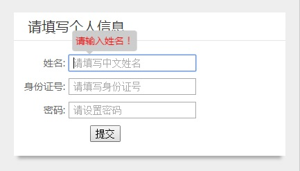

表单的验证是前端开发中经常遇到的一个问题。表单的验证分为客户端验证和服务器验证。
通常情况下，只有验证用户名、密码是否正确等需要读取数据库数据的验证才在服务器端进行验证，而对字符的长度、大小写等字符格式的验证在客户端就能进行。
在客户端使用javascript进行验证能减少服务器负载，缩短用户等待时间，对用户更友好。比较知名的js表单验证插件有validate.js、jFormer、jQuery.validVal等等。
使用正则表达式就能打造自己的jQuery表单验证插件。

### 表单验证的关键——正则表达式
判断用户输入的值是否符合尺寸、大小写、字符规则就需要使用正则表达式RegExp。RegExp 对象提供了test()方法来检测字符串是否符合正则表达式模式的规范。
下面的代码是4个应用正则表达式来验证表单元素的检验函数。
例如`isMobile()`方法是检测元素的输入值是否是手机号码的函数，三个参数分别为表单元素的Dom对象ele，错误提示字符串tipText，以及表单输入值。
变量`d`是一个正则表达式对象，通过'RegExp'的'test()'方法的返回值来判定输入值是否符合手机号码的规律。
若不符合就调用一个表单错误提示函数'$.formTips'来提醒用户输入错误。
中国现行的手机号码都是以'13'、'15'、'18'、'14'、'17'开头的11位数字，因此正则表达式是从'13'、'15'、'18'、'14'、'17'开始匹配，并已9位数字结束。
于是`isMobile()`方法的正则表达式可以写成`"^(13|15|18|14|17)[0-9]{9}$"`,`^`和`$`分别是正则表达式的开始匹配符号和结束匹配符号。
按照这样的规律，我们可以编写其他的检验正则表达式用来检测用户的输入值是否符合规定。
如下代码中的`isPhone()`方法、`isEmail()`方法、`isBankNum()`方法分别用来检测固定电话号码、电子邮件以及银行卡号。

```javascript
var isMobile = function(ele,tipText,value){var d=new RegExp("^(13|15|18|14|17)[0-9]{9}$");return d.test(value)?true:$.formTips(ele,tipText)}
var isPhone = function(ele,tipText,value){var d=new RegExp("^([0-9]{3,4}-)?[0-9]{7,8}$");return d.test(value)?true:$.formTips(ele,tipText)}
var isEmail = function(ele,tipText,value){var d=new RegExp("^\\w+((-\\w+)|(\\.\\w+))*\\@[A-Za-z0-9]+((\\.|-)[A-Za-z0-9]+)*\\.[A-Za-z0-9]+$");return d.test(value)?true:$.formTips(ele,tipText)}
var isBankNum = function(ele,tipText,value){var d=new RegExp("^([0-9]{16}|[0-9]{19})$");return d.test(value)?true:$.formTips(ele,tipText)}
```

### 表单验证的示例
如下图是一个简单的表单，三个输入框分别要求输入中文汉字、18位身份证以及6到12位的密码，且都不能为空。


当输入不符合要求就提交时，光标会回到相应的输入框，即自动触发focus事件，如果有滚动条且目标不在可视区域内滚动条也滚动到相应位置。
并且，会在相应输入框的附近弹出提示文本。
核心代码如下，表单验证插件通过extend写入了一个formRules对象来保存表单验证规则，两个函数对象。
其中`formValidate(arrayVali))`方法是用来验证表单的所有输入元素，`formTips(ele,tipText,nofocus)`方法是用来弹出错误提示文本的。
`formValidate(arrayVali))`方法的参数是一个对象数组，里面的元素对象包含了表单元素对象和一个或多个验证规则。
`formValidate(arrayVali))`方法通过循环arrayVali数组里面的每一个对象，获取表单元素的输入值以及相应的验证规则，
并对表单元素的输入值进行验证，一旦发现验证错误，就return一个false值，阻止验证继续。

```html
<div class="form">
    <p><label for="name">姓名:</label><input type="text" id='name' name='name' placeholder="请填写中文姓名"></p>
    <p><label for="identity">身份证号:</label><input type="text" id='identity' name='identity' placeholder="请填写身份证号"></p>
    <p><label for="password">密码:</label><input type="password" id='password' name='password' placeholder="请设置密码"></p>
    <p><button class="submit">提交</button></p>
</div>
<script src="node_modules/jquery/dist/jquery.min.js"></script>
<script>
  $.extend({
    formTips:function(ele,tipText,nofocus){
      var topDoc,topEle;
      ele.after("<span class='tips'>"+tipText+"</span>");
      var topSize = ele.offset().top;
      var leftSize = ele.offset().left;
      $('.tips').css({
        top: topSize-35,
        left: leftSize+5
      })
      setTimeout("$('.tips').remove()",2000);
      return !nofocus&&ele.focus(),topDoc=$(window).scrollTop(),topEle=ele.offset().top-topDoc,50>topEle&&$(window).scrollTop(topDoc-50+topEle),false
    },
    formRules:{
      required:function(ele,tipText,value){return""==value?(ele.val(""),$.formTips(ele,tipText)):true},
      length:function(ele,ruleMsg,value){return value.length<ruleMsg.rule[0]||value.length>ruleMsg.rule[1]?$.formTips(ele,ruleMsg.msg):true},
      isCname : function(ele,tipText,value){var d=new RegExp("^[\u4E00-\u9FA5]{2,9}$");return d.test(value)?true:$.formTips(ele,tipText)},
      isIdNum : function(ele,tipText,value){var d=new RegExp("^([0-9]{17}|[0-9]{18})$");return d.test(value)?true:$.formTips(ele,tipText)},
    },
    formValidate:function(arrayVali){/!*a为验证数组，[{el: el1, rule1: tipText,},{el: el2, rule1: tipText,}]*!/
      var b=this,c=true;
      return $.each(arrayVali,function(index,ele){ /!*ele: {el: el1, ruglar1: tipText,}*!/
        var h,i,rule,fn,arrayRule=[],required=false,value=$.trim(ele.el.val());
        for(h in ele){
          if(h != "el"){
            arrayRule.push(h);
          }
          if(h =='required'){
            required = true;
          }
        }

        if(!required&&value==""){
          return false;
        }

        for(i=0; i<arrayRule.length;i++){
          if(arrayRule[i] in b.formRules){
            rule = arrayRule[i];
            fn=b.formRules[rule](ele.el,ele[rule],value)
            if(!fn){
              return c=false, false;
            }
          }
        }
      }), c;
    }
  });

  $().ready(function(){
    $('.submit').click(function(){
      var name = $('input#name');
      var identity = $('#identity');
      var password = $('#password');
      var v = $.formValidate([
        {el:name,required:"请输入姓名！",isCname:"姓名必须为中文汉字！"},
        {el:identity,required:"请输入身份证号！",isIdNum:"请输入正确的身份证号！"},
        {el:password,required:"请输入密码！",length:{rule:[6,12],msg:"密码长度必须为6到12位"}},
      ]);
      if (!v) {
        return false;
      }
      //ajax
      $.formTips($(this),'填写正确，已提交！');
    });
  });
</script>
```

### 完整源代码请查看我的github的blogDemo项目