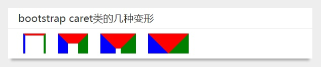
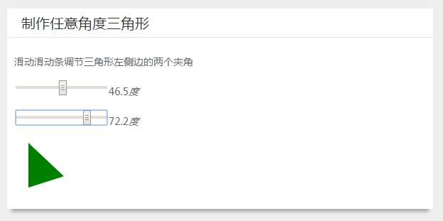
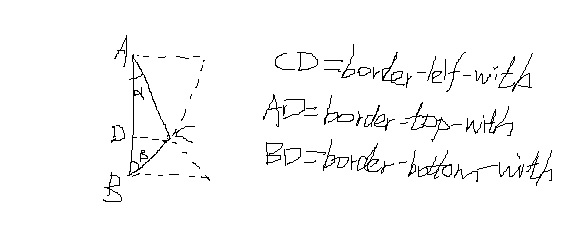
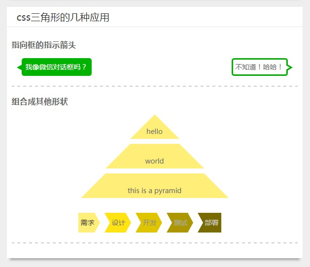

在前面有篇博客，我介绍了[使用css3 transform的skew变形来制作平行四边形](//feleventh.github.io/css3%E5%AE%9E%E7%8E%B0%E5%B9%B3%E8%A1%8C%E5%9B%9B%E8%BE%B9%E5%BD%A2%E6%A1%86%E6%95%88%E6%9E%9C/)。
在网页设计中，最常见的几何形状之一就是三角形了。使用css能制作任意形状的三角形。在bootstrap的样式表中有一个三角形类caret，其代码如下：

```css
.caret {
    display: inline-block;
    width: 0;
    height: 0;
    margin-left: 2px;
    vertical-align: middle;
    border-top: 4px solid;
    border-right: 4px solid transparent;
    border-left: 4px solid transparent;
}
```
### CSS制作三角形的原理

为了弄清楚css制作三角形的原理，我们将bootstrap的三角形类caret做适当修改,为了更好地观察出规律，将top、right、left三个方向的边框颜色分别设置为红绿蓝，将其宽高依次设置为36px、20px、10px、0。

```css
.caret-1 {
  display: inline-block;
  width: 36px;
  height: 36px;
  margin-left: 20px;
  vertical-align: middle;
  border-top: 4px solid red;
  border-right: 4px solid green;
  border-left: 4px solid blue;
}
.caret-2 {
  display: inline-block;
  width: 20px;
  height: 20px;
  margin-left: 20px;
  vertical-align: middle;
  border-top: 20px solid red;
  border-right: 20px solid green;
  border-left: 20px solid blue;
}
.caret-3 {
  display: inline-block;
  width: 10px;
  height: 10px;
  margin-left: 20px;
  vertical-align: middle;
  border-top: 30px solid red;
  border-right: 30px solid green;
  border-left: 30px solid blue;
}
.caret-4 {
  display: inline-block;
  width: 0;
  height: 0;
  margin-left: 20px;
  vertical-align: middle;
  border-top: 40px solid red;
  border-right: 40px solid green;
  border-left: 40px solid blue;
}
```
这四种变形在网页中的效果如下图所示。

从上图中，可以看出三角形斜边是由相邻边框相互遮挡覆盖产生的，当div的宽高逐渐变小直到变为0时，三角形就产生了。
设置其中一个边框为不透明颜色，而其他边框设置为透明，就产生了单个的三角形。
#### 那么怎样生成各种形状的三角形呢？

答案是通过设置各个边框的宽度的长短来产生的。
如下图所示，是设置上下边框为透明，左边框为绿色生成的三角形，设置左边框的宽度为50px，然后调节上下边框为不同的宽度值，就能产生不同的角度的三角形。

当滑动滑块时，通过change事件读取角度值angle，然后设置对应边框的宽度为50px乘角度angle的余弦值。
为什么这么计算呢？
复习下初中的三角函数。如下图是一个任意角度三角形ABC,顶点为A的角的角度值为a,顶点为B的角的角度值为b。
辅助线CD垂直于边AB，那么CD的长度就是左边框的宽度，AD的长度就是顶边框的宽度，BD就是底边框的宽度。
AD=CD/tan(a), BD=cd/tan(b)，这样我们就能计算出其他两个边框的宽度了。

核心代码如下：

```html
<p>滑动滑动条调节三角形左侧边的两个夹角</p>
<p class="border-top"><input type="range" max="89" min="1" step="0.1"><span></span><i>度</i></p>
<p class="border-bottom"><input type="range" max="89" min="1" step="0.1"><span></span><i>度</i></p>
<div class="triangle"></div>
<script src="node_modules/jquery/dist/jquery.min.js"></script>
<script>
  $('p').each(function(){
    $(this).find("span").text($(this).find('input').val());
  })
  $('.border-top input').change(function(){
    var angle = $(this).val();
    $(this).siblings('span').text(angle);
    console.log(Math.tan(angle/180*Math.PI));
    $('.triangle').css({
      borderTopWidth: 50/Math.tan(angle/180*Math.PI)
    })
  })
  $('.border-bottom input').change(function(){
    var angle = $(this).val();
    $(this).siblings('span').text(angle);
    console.log(Math.tan(angle/180*Math.PI));
    $('.triangle').css({
      borderBottomWidth: 50/Math.tan(angle/180*Math.PI)
    })
  })
</script>
```

### css三角形的几种应用

虽然我们可以使用css写出各式各样的三角形，但在网页中使用最多的是等腰三角形、特别是等腰直角三角形。
如下图，对话框、弹出框等等都有使用css三角形作为指向箭头，css三角形也可以制作金字塔、步骤图等表现形式。

核心代码如下：

```html
<div class="card">
    <div class="card-header">css三角形的几种应用</div>
    <div class="card-content">
      <div class="example">
        <h3>指向框的指示箭头</h3>
        <div class="dialog-box-1">我像微信对话框吗？</div>
        <div class="dialog-box-2">不知道！哈哈！</div>
      </div>
      <div class="example">
        <h3>组合成其他形状</h3>
        <div class="pyramid">
          <div class="layer-1">hello</div>
          <div class="layer-2">world</div>
          <div class="layer-3">this is a pyramid</div>
        </div>
        <div class="progress">
          <div class="stage-1">需求</div>
          <div class="stage-2">设计</div>
          <div class="stage-3">开发</div>
          <div class="stage-4">测试</div>
          <div class="stage-5">部署</div>
        </div>
      </div>
    </div>
  </div>
<!-- scss代码如下 -->
.dialog-box-1{
  background-color: lighten(green,10%);
  padding: 8px;
  border-radius: 5px;
  position: relative;
  float: left;
  margin-left: 20px;
  color: #fff;
  &::after{
    display: block;
    position: absolute;
    content: '';
    top: 9px;
    left: -10px;
    border-top: 10px solid transparent;
    border-right: 18px solid lighten(green,10%);
    border-bottom: 10px solid transparent;
  }
}
.dialog-box-2{
  border: 3px solid lighten(green,10%);
  padding: 5px;
  border-radius: 5px;
  position: relative;
  float: right;
  margin-right: 20px;
  &::before{
    display: block;
    position: absolute;
    content: '';
    top: 10px;
    right: -13px;
    border-top: 6px solid transparent;
    border-left: 10px solid lighten(green,10%);
    border-bottom: 6px solid transparent;
  }
  &::after{
    display: block;
    position: absolute;
    content: '';
    top: 6px;
    right: -7px;
    border-top: 10px solid transparent;
    border-left: 18px solid #fff;
    border-bottom: 10px solid transparent;
  }
}
$yellow: #ffef79;
.caret{
  display: block;
  content: '';
  width: 0;
  height: 0;
  position: absolute;
}
.pyramid{
  width: 300px;
  margin: 0 auto;
  &>*{
    background: $yellow;
    height: 30px;
    margin: 0 auto 10px;
    padding-top: 20px;
    position: relative;
    text-align: center;
    line-height: 30px;
  }
  @for $i from 1 through 3 {
    .layer-#{$i} {
      width: 100px * $i;
      &::before{
        @extend .caret;
        top: 0;
        left: 0;
        border-top: 25px solid #fff;
        border-left: 25px solid #fff;
        border-bottom: 25px solid transparent;
        border-right: 25px solid transparent;
      }
      &::after{
        @extend .caret;
        top: 0;
        right: 0;
        border-top: 25px solid #fff;
        border-right: 25px solid #fff;
        border-bottom: 25px solid transparent;
        border-left: 25px solid transparent;
      }
    }
  }
}
.progress{
  width: 310px;
  margin: 30px auto 0;
  height: 40px;
  line-height: 40px;
  &>*{
    float: left;
    position: relative;
    margin-right: 20px;
  }
  .stage-1{
    background: $yellow;
    padding-left: 5px;
    color: #333;
    &::after{
      @extend .caret;
      top: 0;
      right: -11.55px;
      border-left: 11.55px solid $yellow;
      border-top: 20px solid transparent;
      border-bottom: 20px solid transparent;
    }
  }
  .stage-5{
    background: darken($yellow, 50%);
    padding-left: 15px;
    padding-right: 5px;
    color: lighten(#333, 60%);
    &::before{
      @extend .caret;
      top: 0;
      left: 0;
      border-left: 11.55px solid #fff;
      border-top: 20px solid transparent;
      border-bottom: 20px solid transparent;
    }
  }
  @for $j from 2 through 4{
    .stage-#{$j}{
      background: darken($yellow, 10% * $j);
      color: lighten(#333, 12% * $j);
      padding-left: 15px;
      &::after{
        @extend .caret;
        top: 0;
        right: -11.55px;
        border-left: 11.55px solid darken($yellow, 10% * $j);
        border-top: 20px solid transparent;
        border-bottom: 20px solid transparent;
      }
      &::before{
        @extend .caret;
        top: 0;
        left: 0;
        border-left: 11.55px solid #fff;
        border-top: 20px solid transparent;
        border-bottom: 20px solid transparent;
      }
    }
  }
}
```

### 完整源代码请查看我的github的[blogDemo项目](//github.com/feleventh/blogDemo/blob/master/fade-slider.html)