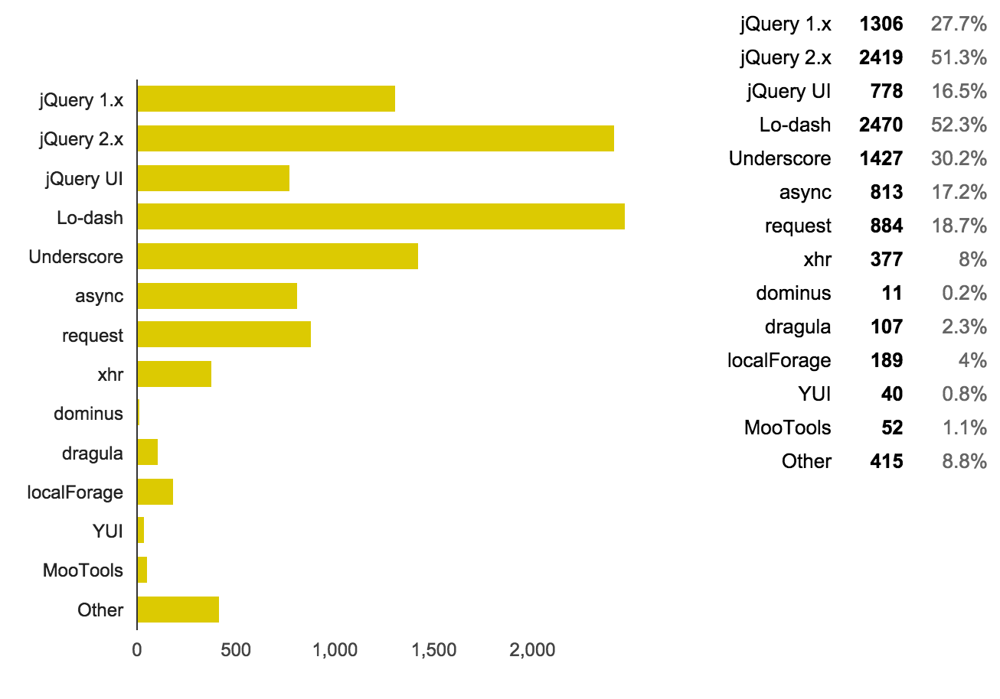

尽管越来越多人已经不建议使用jquery，但jquery仍然是最普遍被使用的javascript库。下图是ponyfoo.com网站在今年初进行的一项名为“Javascript开发者调查”的调查数据。[查看英文原文](https://ponyfoo.com/articles/javascript-developer-survey-results)。



Jquery也在不但地迭代更新，不断进步。目前稳定版本已经更新到3.1.0版本。在使用刚刚Jquery的过程中，曾今有个遇到这样一个问题——

###     jquery的attr方法和prop方法有什么区别？

在jQuery 1.6之前 ，`.attr()`方法在取某些 attribute 的值时，会返回 property 的值，这就导致了结果的不一致。从 jQuery 1.6 开始， `.prop()`方法 方法返回 property 的值,而 `.attr() `方法返回 attributes 的值。例如, selectedIndex, tagName, nodeName, nodeType, ownerDocument, defaultChecked, 和 defaultSelected 应使用.`prop()`方法进行取值或赋值。 在jQuery1.6之前，这些属性使用`.attr()`方法取得，但是这并不是元素的attr属性。他们没有相应的属性（attributes），只有特性(property)。
 
对于非元素规定的特性的属性值，以及自定义的属性如以“data-”开头的属性都应该使用`attr()`。在平时的应用过程中，html的表单中会经常错用attr()和prop（）而产生错误。、

#### 表单中使用正确使用attr()和prop()示例

在下面例子中点击select all fruit checkbox实现选中上面列表中的三个checkbox，再次点击取消选中。checkbox的checked属性就属于checkbox以及radio等表单元素特有的属性，点击select all fruit在浏览器的控制台中打出`$this.prop('checked')`和`$this.attr('checked')`，发现分别输出true和undefined。再次点击这输出false和undefined,
可见，attr()是不能获取到checked属性的。虽然attr()不能获取到checked属性，却可以用来改变checked属性，但我不见你这里使用attr()来改变checkbox的checked属性，因为在一些低版本的浏览器中可能会出现兼容性问题。
同时，在需要使checkbox取消选中状态时，也不建议使用removeProp来实现，这样可能在一些浏览器中永久性删除checked属性而导致通过prop不能再添加上checked属性。

```html
<!DOCTYPE html>
<html lang="en">
<head>
  <meta charset="UTF-8">
  <title>jquery-attr-prop</title>
</head>
<body>
  <h1>jquery的attr()方法和prop()方法</h1>
  <ul>
      <li><label><input type="checkbox">apple</label></li>
      <li><label><input type="checkbox">orange</label></li>
      <li><label><input type="checkbox">banana</label></li>
  </ul>
  <p><label><input type="checkbox">selete all fruit</label></p>
  <p></p>
  <script src="./node_modules/jquery/dist/jquery.min.js"></script>
  <script>
    $('p input').change(function(event) {
      var $this = $(this);
      console.log($this.prop('checked'));
      console.log($this.attr('checked'));
      if($this.prop('checked')){
        $('li input').prop('checked',true);
        //$('li input').attr('checked',true);
      }else{
        $('li input').prop('checked',false);
        //$('li input').removeProp('checked');
        //$('li input').removeAttr('checked');
      }
    });
    console.log($('img').attr('src'));
    console.log($('img').prop('src'));
  </script>
</body>
</html>
```
#### 图片img的src属性
使用attr()和prop()来获取img元素的src属性时，会得到不同的路径值，还是在上面例子中，在浏览器控制台中分别使用attr()和prop()打出src属性值，发现分别为`./assets/img/on-img.svg`
和`file:///D:/GitHub/Test/assets/img/on-img.svg`，这就说明，attr()获取的是相对路径值，而prop（）获取的是绝对路径值。不过本例都是在chrome48.0中的结果，大家有兴趣可以试一试其他浏览器中的效果。
