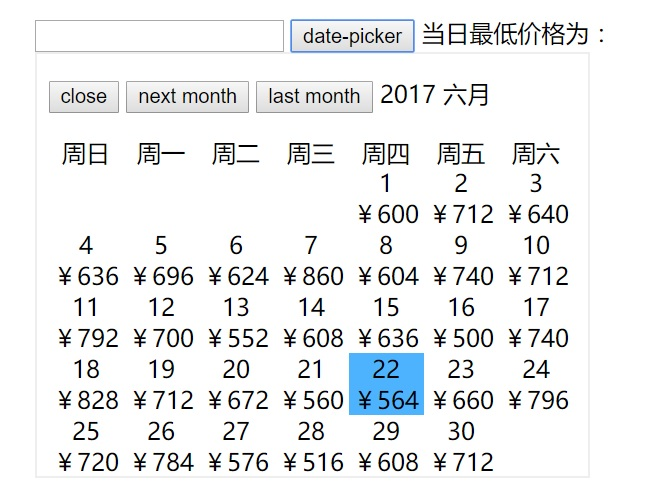

日期选择器是一种比较常用的组件，其制作原理也基本上是
对javascript的Date对象的应用。如下图所示就是一个简单的日历选择器。


### 日期选择器组件需求

* 显示点击按纽显示日历，选中某日期，日历隐藏
* 显示日历与星期对应，显示日期的同时显示当前日期的价格
* 能显示今天的日期添加蓝色，hover状态的日期添加浅蓝色
* 添加下个月，上个月按纽

### 设计思路

* 在模版中可以使用`v-for`指令来一个个日期div, 在data中设置priceDates数组保存日历价格对象，数组的个数为当前月的日数。
* 每月的日数可以通过下个月的1号的前一天来确定是28，29，30还是31
* 日期放到对应的星期列上，只需知道一个月第一天是星期几即可实现一一对应。
* 得出当月1号是周几，即可将1号的div放置到对应星期列上，这里可以使用margin-left来设置，也可以在priceDates数组中插入空对象元素。
* 通过在模版中绑定样式类来添加当前日期以及空白的样式

### 具体实现

具体实现代码如下：

```html
<template>
  <div>
    <h3>check-in date-picker</h3>
    <div>
      <input type="text" :value="pickedDate">
      <button @click="openPicker">date-picker</button>
      <span>当日最低价格为：{{price}}</span>
      <div v-if="datePickerShow" class="date-picker-container">
        <p>
          <button @click="closePicker">close</button>
          <button @click="nextMonth">next month</button>
          <button @click="lastMonth">last month</button>
          <span>{{currentDate.year}}</span>
          <span>{{month}}</span>
        </p>
        <div class="week">
          <div v-for="(item, index) in week">周{{item}}</div>
        </div>
        <div class="dates">
          <div v-for="(item, index) in priceDates" :class="{today: item.isToday, noblank: item.date!==''}"
          @click="pickDate(item.date, item.price)">
            <span>{{item.date}}</span><br>
            <span>{{item.price}}</span>
          </div>
        </div>
      </div>
    </div>
  </div>
</template>
<script>
  export default {
    name: 'check-in',
    data: function () {
      return {
        datePickerShow: false,
        pickedDate: '',
        price: '',
        week: ['日', '一', '二', '三', '四', '五', '六'],
        priceDates: [],
        currentDate: {
          year: '',
          month: 0,
          date: ''
        }
      }
    },
    computed: {
      month: function () {
        const months = ['一', '二', '三', '四', '五', '六', '七', '八', '九', '十', '十一', '十二']
        return months[this.currentDate.month] + '月'
      }
    },
    methods: {
      openPicker: function () {
        this.priceDates = []
        const now = new Date()
        const year = now.getFullYear()
        const month = now.getMonth()
        const date = now.getDate()
        this.currentDate.year = year
        this.currentDate.month = month
        this.currentDate.date = date
        now.setDate(1)
        // now已经变为当月第一天
        const firstDay = now.getDay() // 当月第一天是星期几
        now.setMonth(month + 1)
        now.setDate(1)
        // now 变为下一个月第一天
        const lastDate = new Date(now - 24 * 3600 * 1000).getDate() // 当月最后一天是几号
        var dates = []
        for (let i = 0; i < firstDay; i++) {
          dates.push('')
          this.priceDates.push({date: '', price: '', isToday: false})
        }
        for (let i = 1; i < lastDate + 1; i++) {
          dates.push('' + i)
          this.priceDates.push({
            date: '' + i,
            price: '￥' + (500 + Math.random().toFixed(2) * 400),
            isToday: this.currentDate.month === month && i === this.currentDate.date
          })
        }
        console.log(this.priceDates)
        this.datePickerShow = true
      },
      lastMonth: function () {
        if (this.currentDate.month !== 0) {
          this.currentDate.month--
        } else {
          this.currentDate.month = 11
          this.currentDate.year--
        }
        const now = new Date()
        const month = now.getMonth()
        now.setMonth(this.currentDate.month)
        now.setDate(1)
        const firstDay = now.getDay() // 当月第一天是星期几
        const lastDate = new Date(now - 24 * 3600 * 1000).getDate() // 当月最后一天是几号
        this.priceDates = []
        for (let i = 0; i < firstDay; i++) {
          this.priceDates.push({date: '', price: '', isToday: false})
        }
        for (let i = 1; i < lastDate + 1; i++) {
          this.priceDates.push({
            date: '' + i,
            price: '￥' + (500 + Math.random().toFixed(2) * 400),
            isToday: this.currentDate.month === month && i === this.currentDate.date
          })
        }
      },
      nextMonth: function () {
        if (this.currentDate.month !== 11) {
          this.currentDate.month++
        } else {
          this.currentDate.month = 0
          this.currentDate.year++
        }
        const now = new Date()
        const month = now.getMonth()
        now.setMonth(this.currentDate.month)
        now.setDate(1)
        const firstDay = now.getDay() // 当月第一天是星期几
        const lastDate = new Date(now - 24 * 3600 * 1000).getDate() // 当月最后一天是几号
        this.priceDates = []
        for (let i = 0; i < firstDay; i++) {
          this.priceDates.push({date: '', price: '', isToday: false})
        }
        for (let i = 1; i < lastDate + 1; i++) {
          this.priceDates.push({
            date: '' + i,
            price: '￥' + (500 + Math.random().toFixed(2) * 400),
            isToday: this.currentDate.month === month && i === this.currentDate.date
          })
        }
      },
      closePicker: function () {
        this.datePickerShow = false
      },
      pickDate: function (date, price) {
        this.datePickerShow = false
        this.pickedDate = this.currentDate.year + '-' + (this.currentDate.month + 1) + '-' + date
        this.price = price
      }
    }
  }
</script>

<style lang="less" scoped>
  .date-picker-container{
    width: 370px;
    border: solid #eee 1px;
    box-shadow: #efefef 1px 1px -1px -1px;
    padding: 0 8px;
    .week{
      width: 350px;
      height: 20px;
      div{
        width: 50px;
        height: 20px;
        float: left;
        text-align: center;
        word-spacing: 0;
      }
    }
    .dates{
      &>div{
        width: 50px;
        display: inline-block;
        text-align: center;
      }
      .today{
        background-color: #4db3ff;
      }
      .noblank{
        cursor: pointer;
        &:hover{
          background-color: #6dd3ff;
        }
      }
    }
  }
</style>
```

