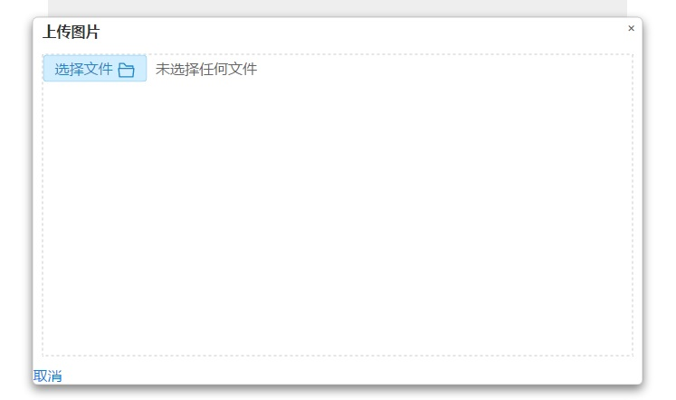
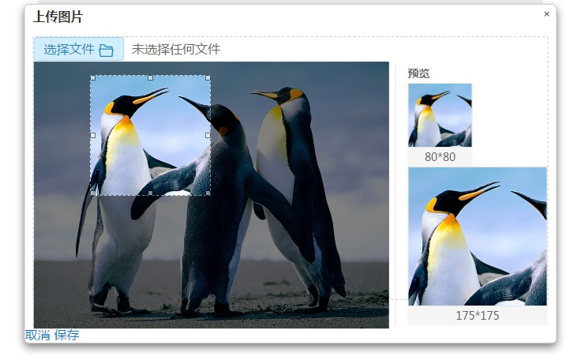

图片的上传是很多网页中都常见的一个功能，而在用户从本地或网络资源中选定图片之后，往往还有涉及图片的裁剪以及预览。
html5为input增加了file类型来使文档在客户端获取文件，也有了FormData对象来上传到服务器端。但是，在上传图片前，往往需要进行图片的预览和裁剪。
借助很多插件，如imgareaselect的jquery插件可以进行图片的裁剪。

如上图是示例demo的效果图，通过将a标签内的input[file]设置为透明来自定义input【file】的样式。
选定上传的图片后，当file的value值触发change事件，获取input[file]的value值来进行图片的预览。
但是浏览器处于安全性的考虑，是不能获取所上传图片的完整路径的。因此需要进行getUploadUrl方法处理后获取本地文件的路径。
其代码如下：

```javascript
function getUploadUrl(node){
		'use strict';
		var imgURL = "";
		try{
			var file = null;
			if(node.files && node.files[0] ){
				file = node.files[0];
			}else if(node.files && node.files.item(0)) {
				file = node.files.item(0);
			}
			//Firefox 因安全性问题已无法直接通过input[file].value 获取完整的文件路径
			try{
				//Firefox7.0
				imgURL =  file.getAsDataURL();
				//alert("//Firefox7.0"+imgRUL);
			}catch(e){
				//Firefox8.0以上
				imgURL = window.URL.createObjectURL(file);
				//alert("//Firefox8.0以上"+imgRUL);
			}
		}catch(e){      
			//支持html5的浏览器,比如高版本的firefox、chrome、ie10
			if (node.files && node.files[0]) {
				var reader = new FileReader();
				reader.onload = function (e) {
					imgURL = e.target.result;
				};
				reader.readAsDataURL(node.files[0]);
			}
		}
		return imgURL;
	}
```

然后就通过将要显示图片的src属性修改为获取到的要上传图片的路径就可以显示图片了。在显示出图片之后就可以使用imgareaselect插件进行裁剪区域的选取。
其实质是获取选取区域的宽、高、左上角和右下角的相对坐标等数据，并通过对图片的缩放来进行不同尺寸下的预览。效果如下图：


核心代码如下
```javascript
	var select = {
		x1: 0,
		x2: 0,
		y1: 0,
		y2: 0,
		x: 0,
		y: 0,
		w: 0,
		h: 0,
		src_width: 0,
		src_height: 0,
	}
	//preview方法 img图片参数，selection选区参数
	function preview(img, selection) {

		//重新设置x、y、w、h的值
		select.x=selection.x1;
		select.y=selection.y1;
		select.x1=selection.x1;
		select.y1=selection.y1;
		select.x2=selection.x2;
		select.y2=selection.y2;
		select.w = selection.x2 - selection.x1;
		select.h = selection.y2 - selection.y1;
		preview_photo($('.preview1 .img-box'), selection);
		preview_photo($('.preview2 .img-box'), selection);
	}

	//preview_photo()方法 左一的图片调整（与选区的图片显示一致）
	//div_class是对应div的class
	function preview_photo(dom, selection) {

		//获取div的宽度与高度
		var width = dom.outerWidth();
		var height = dom.outerHeight();
		var scaleX = width / selection.width;
		var scaleY = height / selection.height;
		var src_width = select.src_width;
		var src_height = select.src_height;
		dom.find('img').css({
			width: Math.round(scaleX * parseInt(src_width)) + 'px',
			height: Math.round(scaleY * parseInt(src_height)) + 'px',
			marginLeft: '-' + Math.round(scaleX * selection.x1) + 'px',
			marginTop: '-' + Math.round(scaleY * selection.y1) + 'px',
			top: 0,
			transform: 'none',
		});
	}
$().ready(function(){
	$('.card-content button').click(function(){
		$('.modal.upload-img').removeClass ('hide');
	});

	//upload click
	$('.up-load .file input').change(function (event) {
		var fakeSrc = $.trim($(this).val()).toLowerCase();
		var type = fakeSrc.substr(fakeSrc.indexOf('.',-5)+1).replace('.','');
		console.log(type);
		if(!(type==='jpg'||type==='jpeg')){
			$(this).val('');
			return alert({content:'图片格式必须为jpg或jpeg！'});
		}
		console.log(event.target.files[0].size);
		if(event.target.files[0].size>2*1024*1024){
			return alert({content:'图片大小不得超过2M！'});
		}
		var imgSrc = getUploadUrl($(this)[0]);
		//verification
		$(this).parents('.upload').addClass('hide');
		$('.img-select').removeClass('hide');
		$('.btn-save').removeClass('hide');
		$('.img-select .left img').addClass('loaded-img').attr('src',imgSrc);
		$('.preview1 img').css('display','block').attr('src',imgSrc);
		$('.preview2 img').css('display','block').attr('src',imgSrc);
		$('#select-img').ready(function(){
			var wrap_height = $(this).parent().height();
			var src_width = $('#select-img').width();
			var src_height = $('#select-img').height();
			console.log('width:'+src_width+' '+'height'+src_height);
			if(src_width>476){
				$('#select-img').css({width: '476px', height: 476/src_width*src_height+'px'});
			}
			if(src_height>wrap_height){
				$(this).css({
					height: '100%',
					width:'auto',
					left: '50%',
					top: 0,
					transform: 'translateX(-50%)',
				});
			}
			select.src_width = src_width;
			select.src_height = src_height;
			console.log(select.src_width+" "+select.src_height);
			imgAreaSelectApi = $('#select-img').imgAreaSelect({
				fadeSpeed: 200,
				imageHeight: src_height,
				imageWidth: src_width,
				minHeight: 104,
				minWidth: 104,
				//persistent : true,  // true，选区以外点击不会启用一个新选区（只能移动/调整现有选区）
				instance: true, //true，返回一个imgAreaSelect绑定到的图像的实例，可以使用api方法
				onSelectChange: preview,
				x1: 0,
				y1: 0,
				x2: src_width<src_height ? src_width : src_height,
				y2: src_width<src_height ? src_width : src_height, // 改变选区时的回调函数
				show: true, // 选区会显示
				handles: true, // true，调整手柄则会显示在选择区域内
				resizable: true, // true， 选区面积可调整大小
				aspectRatio: '1:1' // 选区的显示比率 400:300*/
			});

			imgAreaSelectApi.setSelection(0, 0 , 175, 175);
			imgAreaSelectApi.update();
		});
	});
});    
```

### 完整源代码请查看我的github的[blogDemo项目](//github.com/feleventh/blogDemo/blob/master/img_upload_select.html), 
[demo演示](//feleventh.github.io/blogDemo/img_upload_select.html)。

