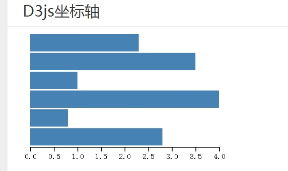

前端的数据可视化插件有很多，例如echarts,chart.js,hightchart等等，但是这些高度定制化的图表插件往往过于死板，只能使用其提供的图表模版，对于一些高度个性化图表则束手无策。d3.js可以像jquery操作dom那样方便地操作svg元素，利用svg可以绘制任意2d图表，甚至代替leafletjs来制作地图。

#### select()和append()

d3.js的select()方法和append()方法很类似jquery的DOM操作方法，能操作DOM和svg节点。而且d3.js也支持jquery那样的链式写法，如下图所示，使用d3向文档中添加svg/path元素节点。


其代码如下：

```javascript
        function D3Widget (options) {
            var instance = {}
            var headline, description

            instance.render = function () {
                var div = d3.select('.d3-start .card-content').append('div');
                div.append('h3').text(headline)
                div.attr('class', 'box')
                  .attr('style','color: ' + options.color)
                  .append('p')
                  .text(description)
                var svg = div.append('svg')
                  .attr('width','100%')
                  .attr('height','200')
                var g = svg.append('g')
                g.append('path')
                  .attr('d', 'M10 10 L100 50 L100 200 L20 200Z')
                  .attr('stroke', 'red')
                  .attr('stoke-width', 2)
                  .attr('fill', 'rgb(120,47,231)')
                g.append('text')
                  .attr('x', 50)
                  .attr('y', 50)
                  .text('simple demo')
                  .attr('transform', 'rotate(30)')
                return instance
            }

            instance.headline = function (h) {
                if (!arguments.length) return headline
                headline = h
                return instance
            }

            instance.description = function (d) {
                if (!arguments.length) return description
                description = d
                return instance
            }
            return instance
        }

        var d3Widget = D3Widget({color: '#6495ed'})
          .headline('Simple demo')
          .description('this is a simple demo about d3.js and svg')
        d3Widget.render()
```

在上图的示例中，通过设置transform属性的rotate方法对svg/text元素进行了旋转变换。在这里值得注意的是，svg的rotate、scale、translate等等transform的变换与css3的transform有一些差异，svg的translate可以看成整个坐标系的变换而不是元素的变换。对于一般浏览器而言，除了rotate可以定义相当于transform-origin的参数以外，其他transform的方法都是相对于左上角的变换。例如一个svg元素通过scale(2)尺寸变大2倍，其x坐标和y坐标也会变大2倍。但是firefox浏览器是可以支持transfrom-origin的，而其他浏览器基本不支持这一属性。

#### d3.js饼图

如下图是使用d3.js制作的饼图，d3.js的arc对象可以用来画饼图所需的弧线, outerRadius - innerRadius 的结果就是弧线的粗细，内径大于0时也就成了下图中的圆环图。利用d3.interpolate插值方法来呈现加载动画效果。


核心代码如下

```javascript
      var width = 400, height = 400, endAngle = 2*Math.PI,
          colors = d3.scaleOrdinal(d3.schemeCategory20c)
      var svgChart = d3.select('.d3-chart .card-content').append('svg')
        .attr('class', 'pie')
        .attr('height', height)
        .attr('width', width)
      function render (innerRadius) {
        var data = [
          {startAngle: 0, endAngle: 0.1*endAngle},
          {startAngle: 0.1*endAngle, endAngle: 0.2*endAngle},
          {startAngle: 0.2*endAngle, endAngle: 0.4*endAngle},
          {startAngle: 0.4*endAngle, endAngle: 0.6*endAngle},
          {startAngle: 0.6*endAngle, endAngle: 0.7*endAngle},
          {startAngle: 0.7*endAngle, endAngle: 0.9*endAngle},
          {startAngle: 0.9*endAngle, endAngle: endAngle}
        ]
        var arc = d3.arc().outerRadius(200).innerRadius(innerRadius)
        svgChart.select('g').remove()
        svgChart.append('g')
          .attr('transform', 'translate(200, 200)')
          .selectAll('path.arc')
          .data(data)
          .enter()
          .append('path')
            .attr('class','arc')
            .attr('fill', function(d, i){
            	return colors(i)
            })
            .transition().duration(1000)
            .attrTween('d', function(d){
            	var start = {startAngle: 0, endAngle: 0}
            	var interpolate = d3.interpolate(start, d)
              return function (t) {
                return arc(interpolate(t))
              }
            })
      }

      render(100)
```

#### d3.js坐标轴


饼形图并不需要坐标轴，但柱形图、气泡图以及折线图都需要坐标来呈现数据。scaleLinear和scalePower分别是线性度量尺和指数度量尺，domain()方法定义度量尺的度量范围，range()方法定义刻度尺对应的长度。使用axisBottom()将坐标轴放在底部，并使用scale()使用scaleLinear度量尺，ticks()方法在坐标轴上添加刻度。

```javascript
      var axisSvg = d3.select('.d3-axis .card-content').append('svg')
        .attr('height', height)
        .attr('width', width)
      var dataset = [2.3, 3.5, 1,4, 0.8, 2.8]
      var linear = d3.scaleLinear()
        .domain([0, d3.max(dataset)])
        .range([0, 250])
      var rectHeight = 25
      axisSvg.selectAll('rect')
        .data(dataset)
        .enter()
        .append('rect')
        .attr('x',20)
        .attr('y', function(d, i){
          return i*rectHeight
        })
        .attr('width', function(d){
          return linear(d)
        })
        .attr('height', rectHeight-2)
        .attr('fill', 'steelblue')
      var axis = d3.axisBottom()
        .scale(linear)
        .ticks(7)
      axisSvg.append('g')
        .attr('class','axis')
        .attr('transform','translate(20,150)')
        .call(axis)
```

### 完整源代码请查看我的github的[blogDemo项目](//github.com/feleventh/blogDemo/blob/master/d3_select.html), 
[demo演示](//feleventh.github.io/blogDemo/d3_select.html)。

