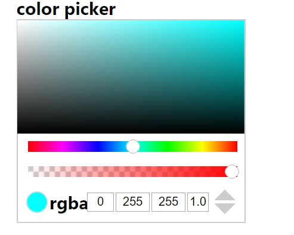
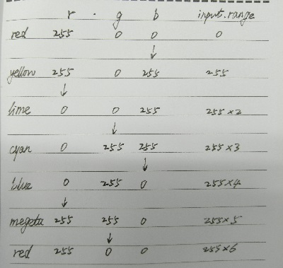

去年我使用react编写了chrome控制台风格的取色器，现在使用vue重写[chrome风格取色器](://feleventh.github.io/react_color_picker/)，基本实现了相同的功能。
但由于vue.js与react.js的区别，具体实现上也有了较大区别。


#### data设置所需的基本数据
由于取色器是由2个`input[type=range]`和取色圈`div.color-circle`的位置的数据来驱动的，于是从这三个数据入手，data属性如下：
```javascript
  data: function () {
      return {
        rgbRangeValue: 765, // rgb滑块值
        alphaRangeValue: 255, // alpha滑块值
        imgData: [], // 保存canvas imageDate
        width: 296, // 宽度
        measures: ['hex', 'rgba', 'hsla'], // 可选的颜色值单位
        measure: 'hex', // 所选的颜色值单位
        circleIsShow: false, // 显示取色环
        x: 256, // 取色环的x坐标
        y: 0 // 取色环的y坐标
      }
    },
```

rgb滑块的设定是以red、magenta、blue、cyan、lime、yellow这六个主色调之间平滑渐变来设置数值的。
如下图所示，将`input[type=range]`的step设置为1，每个主色调占据255个数值，
那么总共有255*6 =765个数值，每滑动255个数的距离就改变一个主色调。

rgb滑块决定的是矩形色块右上角的颜色值，x和y则共同决定了在矩形色块内点选的颜色，
右上角的rgb颜色值为[255,255,255]，左下角和右下角都为[0,0,0],真个矩形内颜色平滑过渡。
这样就可以在滑动rgb滑块时，所有属于当前色调的颜色都能显示在矩形色块内。
同时，当我们在最下面的输入框内输入一个任意的颜色值，可以在矩形色块内找到这个颜色值，其步骤如下：
* 先根据输入颜色值找到主色调，即矩形色块右上角的颜色值，它是由rgb滑块所决定的。
根据上图的6个主色调的rgb颜色范围，将输入的颜色值的最大值放大到255，最小值缩小为0，
* 如果有相等的，就选取第一个值作为最值，这样就找到了rgb滑块的数值(最大值最小值以外的那个值 * 放大倍数)。
* 再根据放大倍数就可以逆推出取色圈所在的坐标。
#### computed计算属性
```javascript
computed: {
      leftTop: function () {
        return {
          left: this.x - 5 + 'px',
          top: this.y - 5 + 'px'
        }
      },
      rgba: function () {
        this.rgbRangeValue = parseInt(this.rgbRangeValue)
        this.alphaRangeValue = parseInt(this.alphaRangeValue)
        const n = Math.floor(this.rgbRangeValue / 255) // rgbRangeValue has times of 256
        var rgba = new Array(4)
        switch (n) {
          case 0:
            rgba[0] = 255
            rgba[1] = 0
            rgba[2] = this.rgbRangeValue
            break
          case 1:
            rgba[0] = 255 - (this.rgbRangeValue - 255)
            rgba[1] = 0
            rgba[2] = 255
            break
          case 2:
            rgba[0] = 0
            rgba[1] = this.rgbRangeValue - 255 * 2
            rgba[2] = 255
            break
          case 3:
            rgba[0] = 0
            rgba[1] = 255
            rgba[2] = 255 * 4 - this.rgbRangeValue
            break
          case 4:
            rgba[0] = this.rgbRangeValue - 255 * 4
            rgba[1] = 255
            rgba[2] = 0
            break
          default:
            rgba[0] = 255
            rgba[1] = 255 * 6 - this.rgbRangeValue
            rgba[2] = 0
        }
        rgba[3] = this.alphaRangeValue
        return rgba
      },
      hex: function () {
        var string = '#'
        Array.prototype.forEach.call(this.pickRgb, function (cv, index) {
          if (index < 3) {
            cv > 16 ? string = string + cv.toString(16) : string = string + '0' + cv.toString(16)
          }
        })
        return string
      },
      alpha: function () {
        var alpha = parseInt(this.alphaRangeValue)
        alpha = Number.prototype.toFixed.call(alpha / 255, 1)
        return alpha
      },
      pickRgb: function () {
        var pickRgb = new Array(3)
        const x = this.x
        const y = this.y
        const rgba = this.rgba
        const width = 256
        const height = 128
        pickRgb[0] = parseInt((255 * (1 - x / width) + parseInt(rgba[0]) * x / width) * (1 - y / height))
        pickRgb[1] = parseInt((255 * (1 - x / width) + parseInt(rgba[1]) * x / width) * (1 - y / height))
        pickRgb[2] = parseInt((255 * (1 - x / width) + parseInt(rgba[2]) * x / width) * (1 - y / height))
//        console.log(255 * (1 - x / width))
        return pickRgb
      },
      pickHsl: function () {
        const r = this.pickRgb[0] / 255
        const g = this.pickRgb[1] / 255
        const b = this.pickRgb[2] / 255
        const max = Math.max(r, g, b)
        const min = Math.min(r, g, b)
        let h
        let s
        let l = (max + min) / 2

        if (max === min) {
          h = s = 0 // achromatic
        } else {
          const d = max - min
          s = l > 0.5 ? d / (2 - max - min) : d / (max + min)
          switch (max) {
            case r: h = (g - b) / d + (g < b ? 6 : 0); break
            case g: h = (b - r) / d + 2; break
            case b: h = (r - g) / d + 4; break
          }
          h /= 6
        }
        h = parseInt(h * 360)
        s = parseInt(s * 100) + '%'
        l = parseInt(l * 100) + '%'

        return [h, s, l]
      }
```

在计算属性里，将leftTop设置为取色圈的css样式对象并绑定到模版中去，
当点击事件、拖拽事件改变x,y坐标时，同步改变取色圈的位置。

rgba为rgb颜色滑块和alpha滑块所决定的取色矩形右上角的颜色值。
alpha、pickRgb、pickHsl、hex分别为选取不同颜色单位时，显示或输入的颜色值。

#### mounted方法
在生命周期mounted钩子方法中，发现立即执行`renderColorBlock()`方法，并不能渲染到取色块，
必须等设置setTimeout来延迟执行。可能是mounted生命周期内，
canvas的`getContext`和`createImageData`未执行的原因。
```javascript
mounted: function () {
      this.imgData = getImageData(this.width, ...this.rgba)
      const that = this
      setTimeout(function () {
        that.renderColorBlock()
      }, 20)
    },
```

#### watch方法
在watch方法内，监听rgba计算属性，当rgba改变时，立即重新渲染取色矩形canvas
```javascript
watch: {
      rgba: function () {
        this.imgData = getImageData(this.width, ...this.rgba)
        this.renderColorBlock()
        console.log(this.rgba)
      }
    },
```

#### 其他代码
完整项目代码详见我的github项目[3air](://github.com/feleventh/3air/tree/master/src/components)

```javascript
methods: {
      renderColorBlock: function () {
        const dom = this.$refs['colorBlock']
        const context = dom.getContext('2d')
        const image = context.createImageData(this.width, this.width / 2)
//        console.log(this.imgData)
        for (let i = 0; i < image.data.length; i++) {
          image.data[i] = this.imgData[i]
        }
        context.putImageData(image, 0, 0)
      },
      nextMeasure: function () {
        const index = Array.prototype.indexOf.call(this.measures, this.measure)
        var measure = this.measure
        index === 0 ? measure = this.measures[this.measures.length - 1] : measure = this.measures[index - 1]
        this.measure = measure
      },
      lastMeasure: function () {
        const index = Array.prototype.indexOf.call(this.measures, this.measure)
        var measure = ''
        index === this.measures.length - 1 ? measure = this.measures[0] : measure = this.measures[index + 1]
        this.measure = measure
      },
      positionToRgb: function () {
        var pickRgb = []
        pickRgb[0] = parseInt((255 * (1 - this.x / 256) + this.rgba[0] * this.x / 256) * (1 - this.y / 128))
        pickRgb[1] = parseInt((255 * (1 - this.x / 256) + this.rgba[1] * this.x / 256) * (1 - this.y / 128))
        pickRgb[2] = parseInt((255 * (1 - this.x / 256) + this.rgba[2] * this.x / 256) * (1 - this.y / 128))
        console.log(this.x, this.y)
        console.log(pickRgb)
        this.pickRgb = pickRgb
      },
      showColorCircle: function (event) {
        if (this.circleIsShow !== true) {
          this.circleIsShow = true
        }
        const rect = this.$refs['colorBlock'].getBoundingClientRect()
        const top = rect.top
        const left = rect.left
        const disX = event.clientX - left
        const disY = event.clientY - top
//        console.log(top, left)
        this.x = disX
        this.y = disY
        this.positionToRgb()
//        console.log(disX, disY)
      },
      handleMouseDown: function (event) {
        if (this.circleIsShow !== true) {
          this.circleIsShow = true
        }
        const target = event.target
        const disX = event.clientX - target.offsetLeft  // 鼠标与元素边框的距离
        const disY = event.clientY - target.offsetTop
        const that = this
        document.onmousemove = function (event) {  // 鼠标按下拖动
          var l = event.clientX - disX
          var t = event.clientY - disY
          l > 250 ? l = 250 : false
          l < -5 ? l = -5 : false
          t > 254 / 2 - 5 ? t = 254 / 2 - 5 : false
          t < -5 ? t = -5 : false
          that.x = l + 5
          that.y = t + 5
          that.positionToRgb()
        }
        document.onmouseup = function (event) {
          document.onmousemove = null
          document.onmouseup = null
        }
      },
      changeValue: function (event) {
        console.log(event.target.value)
      },
      changeRgb: function () {
        this.pickRgb.forEach((cv, index, arr) => {
          arr[index] = parseInt(cv)
        })
        const max = Math.max.apply(null, this.pickRgb)
        const min = Math.min.apply(null, this.pickRgb)
        if (max > 255 || min < 0) {
          return console.log('the value is out of range')
        }
        let maxIndex = this.pickRgb.indexOf(max)
        let minIndex = this.pickRgb.indexOf(min)
        if (max === min) {
          maxIndex = 0
          minIndex = 1
        }
        console.log(maxIndex, minIndex)
        let rgb = []
        let index = `${maxIndex},${minIndex}`
        switch (index) {
          case '0,1':
            rgb = [255, 0, this.pickRgb[2] * max / 255]
            this.rgbRangeValue = parseInt(rgb[2])
            break
          case '2,1':
            rgb = [this.pickRgb[0] * max / 255, 0, 255]
            this.rgbRangeValue = parseInt(2 * 255 - rgb[0])
            break
          case '2,0':
            rgb = [0, this.pickRgb[1] * max / 255, 255]
            this.rgbRangeValue = parseInt(2 * 255 + rgb[1])
            break
          case '1,0':
            rgb = [0, 255, this.pickRgb[2] * max / 255]
            this.rgbRangeValue = parseInt(4 * 255 - rgb[2])
            break
          case '1,2':
            rgb = [this.pickRgb[0] * max / 255, 255, 0]
            this.rgbRangeValue = parseInt(4 * 255 + rgb[0])
            break
          case '0,2':
            rgb = [255, this.pickRgb[1] * max / 255, 0]
            this.rgbRangeValue = parseInt(6 * 255 - rgb[1])
            break
        }
        this.rgba = rgb.concat([this.rgba[3]])
        console.log(max, min)
        this.x = parseInt(255 - 255 * min / max)
        this.y = parseInt(128 - 128 * max / 255)
        this.circleIsShow = true
        console.log(this.rgbRangeValue)
        console.log(this.rgba)
      },
      changeHex: function (event) {
        console.log(event.target.getAttribute('value'))
        const hex = this.hex
        console.log(this.hex)
        const pattern1 = /^#[0-9a-fA-F]{3}$/
        const pattern2 = /^#[0-9a-fA-F]{6}$/
        if (pattern1.test(hex)) {
          this.pickRgb[0] = parseInt(hex.substr(1, 1), 16) * 17
          this.pickRgb[1] = parseInt(hex.substr(2, 1), 16) * 17
          this.pickRgb[2] = parseInt(hex.substr(3, 1), 16) * 17
        } else if (pattern2.test(hex)) {
          this.pickRgb[0] = parseInt(hex.substr(1, 2), 16)
          this.pickRgb[1] = parseInt(hex.substr(3, 2), 16)
          this.pickRgb[2] = parseInt(hex.substr(5, 2), 16)
        } else {
          return console.log('the input value is out of range')
        }
        this.changeRgb()
      },
      changeHsl: function () {
        let rgb = hslToRgb(parseInt(this.pickHsl[0]) / 360,
          parseInt(this.pickHsl[1].replace('%', '')) / 100,
          parseInt(this.pickHsl[2].replace('%', '')) / 100)
        console.log(rgb)
        this.pickRgb = rgb
        this.changeRgb()
      },
      changeAlpha: function (event) {
        console.log(event.target.value)
        let alpha = parseInt((parseFloat(event.target.value) * 255))
        this.alphaRangeValue = alpha
        this.rgba[3] = alpha
        console.log(this.rgba)
      }
    }
```